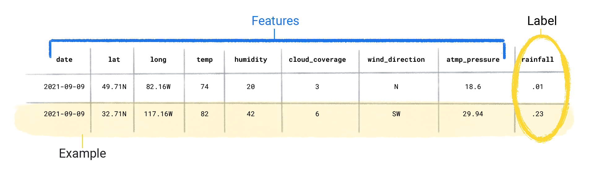
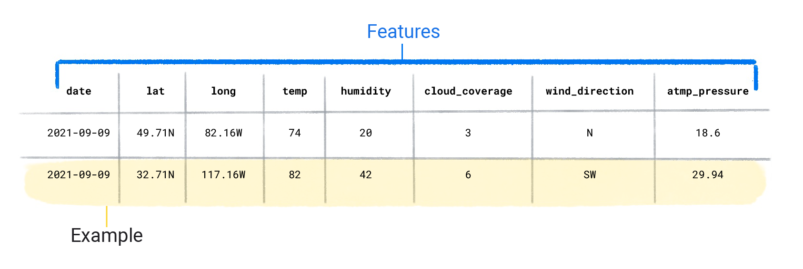
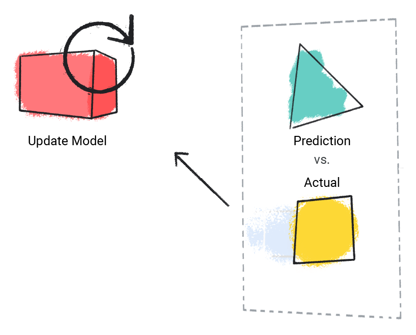

# Supervised Learning

Supervised learning's tasks are well-defined and can be applied to a multitude of scenarios—like identifying spam or predicting precipitation.

## Foundational supervised learning concepts

Supervised machine learning is based on the following core concepts:

- Data
- Model
- Training
- Evaluating
- Inference

### Data

Data comes in the form of words and numbers stored in tables, or as the values of pixels and waveforms captured in images and audio files

we might have a dataset of the following:

- Images of cats
- Housing prices
- Weather information

Datasets are made up of individual examples that contain features and a label
an example as analogous to a single row in a spreadsheet.

- Features are the values that a supervised model uses to predict the label.
- The label is the "answer," or the value we want the model to predict.

 In a weather model that predicts rainfall, the features could be latitude, longitude, temperature, humidity, cloud coverage, wind direction, and atmospheric pressure. The label would be rainfall amount.

### Labeled Example

#### fundamentals

An example that contains one or more features and a label. For example, the following table shows three labeled examples from a house valuation model, each with three features and one label:

| Number of bedrooms | Number of bathrooms | House age | House price (label) |
|--------------------|---------------------|-----------|----------------------|
| 3                  | 2                   | 15        | $345,000             |
| 2                  | 1                   | 72        | $179,000             |
| 4                  | 2                   | 34        | $392,000             |

In supervised machine learning, models train on labeled examples and make predictions on unlabeled examples.

Two labeled examples

In contrast, unlabeled examples contain features, but no label. After you create a model, the model predicts the label from the features.

Two unlabeled examples

### Dataset characteristics

- A dataset is characterized by its size and diversity.
- Size indicates the number of examples.
- Diversity indicates the range those examples cover.
Good datasets are both large and highly diverse.

Datasets can be large and diverse, or large but not diverse, or small but highly diverse. In other words, a large dataset doesn't guarantee sufficient diversity, and a dataset that is highly diverse doesn't guarantee sufficient examples.

For instance, a dataset might contain 100 years worth of data, but only for the month of July. Using this dataset to predict rainfall in January would produce poor predictions. Conversely, a dataset might cover only a few years but contain every month. This dataset might produce poor predictions because it doesn't contain enough years to account for variability.

### What attributes of a dataset would be ideal to use for ML?

Large size / High diversity
A large number of examples that cover a variety of use cases is essential for a machine learning system to understand the underlying patterns in the data. A model trained on this type of dataset is more likely to make good predictions on new data.

A dataset can also be characterized by the number of its features. For example, some weather datasets might contain hundreds of features, ranging from satellite imagery to cloud coverage values. Other datasets might contain only three or four features, like humidity, atmospheric pressure, and temperature. Datasets with more features can help a model discover additional patterns and make better predictions. However, datasets with more features don't always produce models that make better predictions because some features might have no causal relationship to the label.

## Model

In supervised learning, a model is the complex collection of numbers that define the mathematical relationship from specific input feature patterns to specific output label values. The model discovers these patterns through training.

## Training

Before a supervised model can make predictions, it must be trained. To train a model, we give the model a dataset with labeled examples.

The model's goal is to work out the best solution for predicting the labels from the features. The model finds the best solution by comparing its predicted value to the label's actual value. Based on the difference between the predicted and actual values—defined as the loss—the model gradually updates its solution.

 In other words, the model learns the mathematical relationship between the features and the label so that it can make the best predictions on unseen data.

For example, if the model predicted 1.15 inches of rain, but the actual value was .75 inches, the model modifies its solution so its prediction is closer to .75 inches.

After the model has looked at each example in the dataset—in some cases, multiple times—it arrives at a solution that makes the best predictions, on average, for each of the examples.

The following demonstrates training a model:

1. The model takes in a single labeled example and provides a prediction.

    
    Figure 1. An ML model making a prediction from a labeled example.

2. The model compares its predicted value with the actual value and updates its solution.

    
    Figure 2. An ML model updating its predicted value.

3. The model repeats this process for each labeled example in the dataset.

    
    Figure 3. An ML model updating its predictions for each labeled example in the training dataset.

In this way, the model gradually learns the correct relationship between the features and the label. This gradual understanding is also why large and diverse datasets produce a better model. The model has seen more data with a wider range of values and has refined its understanding of the relationship between the features and the label.

During training, ML practitioners can make subtle adjustments to the configurations and features the model uses to make predictions.

For example, certain features have more predictive power than others. Therefore, ML practitioners can select which features the model uses during training

For example, suppose a weather dataset containstime_of_day as a feature. In this case, an ML practitioner can add or remove time_of_day during training to see whether the model makes better predictions with or without it.

### Evaluating

We evaluate a trained model to determine how well it learned

When we evaluate a model, we use a labeled dataset, but we only give the model the dataset's features.We then compare the model's predictions to the label's true values.

Figure 4. Evaluating an ML model by comparing its predictions to the actual values.

Depending on the model's predictions, we might do more training and evaluating before deploying the model in a real-world application.

Why does a model need to be trained before it can make predictions?
A model needs to be trained to learn the mathematical relationship between the features and the label in a dataset.

