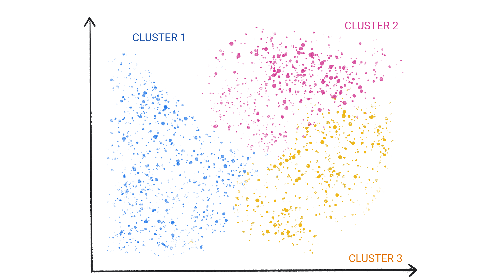

# Introduction to Machine Learning

## Learning objectives

Understand the different types of machine learning.
Understand the key concepts of supervised machine learning.
Learn how solving problems with ML is different from traditional approache

## What is Machine Learning?

ML can predict the weather, estimate travel times, recommend songs, auto-complete sentences, summarize articles, and generate never-seen-before images.

In basic terms, ML is the process of training a piece of software, called a model, to make useful predictions or generate content (like text, images, audio, or video) from data.

For example, suppose we wanted to create an app to predict rainfall. We could use either a traditional approach or an ML approach. Using a traditional approach, we'd create a physics-based representation of the Earth's atmosphere and surface, computing massive amounts of fluid dynamics equations. This is incredibly difficult.

Using an ML approach, we would give an ML model enormous amounts of weather data until the ML model eventually learned the mathematical relationship between weather patterns that produce differing amounts of rain. We would then give the model the current weather data, and it would predict the amount of rain.

Machine Learning is a system that gradually learns how to make useful predictions bu study lot of data to discover connections and correlations.

A machine learning model can continously evolve gradually make better and better predictions

What is model in machine learning?

A model is a mathematical reloationsip derived from data that an Ml system uses to make predictions.

<https://developers.google.com/machine-learning/intro-to-ml/what-is-ml#types_of_ml_systems>

## Types of ML Systems

ML systems fall into one or more of the following categories based on how they learn to make predictions or generate content:

1. Supervised learning
2. Unsupervised learning
3. Reinforcement learning
4. Generative AI

---

## 1. Supervised learning

Supervised learning models can make predictions after seeing lots of data with the correct answers and then discovering the connections between the elements in the data that produce the correct answers.

- This is like a student learning new material by studying old exams that contain both questions and answers. Once the student has trained on enough old exams, the student is well prepared to take a new exam.

- These ML systems are "supervised" in the sense that a human gives the ML system data with the known correct results.

Two of the most common use cases for supervised learning are regression and classification.

### 1. Regression

A regression model predicts a numeric value.

For example, a weather model that predicts the amount of rain, in inches or millimeters, is a regression model.

- A model that predicts a certain house's value in Euros, such as 423,000.
- A model that predicts a certain tree's life expectancy in years, such as 23.2.
- A model that predicts the amount of rain in inches that will fall in a certain city over the next six hours, such as 0.18.

#### Examples of Regression Models

| **Scenario**           | **Possible Input Data**                                                                                                                                          | **Numeric Prediction**                          |
|------------------------|------------------------------------------------------------------------------------------------------------------------------------------------------------------|-------------------------------------------------|
| Future house price     | Square footage, zip code, number of bedrooms and bathrooms, lot size, mortgage interest rate, property tax rate, construction costs, and number of homes for sale in the area. | The price of the home.                          |
| Future ride time       | Historical traffic conditions (gathered from smartphones, traffic sensors, ride-hailing and other navigation applications), distance from destination, and weather conditions. | The time in minutes and seconds to arrive at a destination. |

---

### Two common types of regression models are

Linear regression, which finds the line that best fits label values to features.
Logistic regression, which generates a probability between 0.0 and 1.0 that a system typically then maps to a class prediction.

Not every model that outputs numerical predictions is a regression model. In some cases, a numeric prediction is really just a classification model that happens to have numeric class names. For example, a model that predicts a numeric postal code is a classification model, not a regression model.

### Classification

Classification models predict the likelihood that something belongs to a category. Unlike regression models, whose output is a number, classification models output a value that states whether or not something belongs to a particular category.

For example, classification models are used to predict if an email is spam or if a photo contains a cat.

### Classification models are divided into two groups

- binary classification
- multiclass classification

Binary classification models output a value from a class that contains only two values, for example, a model that outputs either rain or no rain

Multiclass classification models output a value from a class that contains more than two values, for example, a model that can output either rain, hail, snow, or sleet.

A model whose prediction is a class. For example, the following are all classification models:

A model that predicts an input sentence's language (French? Spanish? Italian?).
A model that predicts tree species (Maple? Oak? Baobab?).
A model that predicts the positive or negative class for a particular medical condition.

A regression model might predict the amount of rainfall im cm like 0,8,3.6

A binary classfication model producees an answer to a yes -ot no question. eg prediction like "rain", "no rain".

A multiclass classification yields one possible category from many categories. eg "no rain", "rain", "hail", "snow", "sleet

## If you wanted to use an ML model to predict energy usage for commercial buildings, what type of model would you use?

- Regression
Energy usage is measured in kilowatthours (kWh), which is a number, so you'd want to use a regression model.

## 2. Unsupervised learning

Unsupervised learning models make predictions by being given data that does not contain any correct answers.

An unsupervised learning model's goal is to identify meaningful patterns among the data.
 the model has no hints on how to categorize each piece of data, but instead it must infer its own rules.

A commonly used unsupervised learning model employs a technique called clustering. The model finds data points that demarcate natural groupings.


Figure 1. An ML model clustering similar data points.


Figure 2. Groups of clusters with natural demarcations.

Clustering differs from classification because the categories aren't defined by you.

For example, an unsupervised model might cluster a weather dataset based on temperature, revealing segmentations that define the seasons.

You might then attempt to name those clusters based on your understanding of the dataset.


Figure 3. An ML model clustering similar weather patterns.


Figure 4. Clusters of weather patterns labeled as snow, sleet, rain, and no rain.

### What distinguishes a supervised approach from an unsupervised approach?

A supervised approach is given data that contains the correct answer.

The model's job is to find connections in the data that produce the correct answer. An unsupervised approach is given data without the correct answer. Its job is to find groupings in the data.

The most common use of unsupervised machine learning is to cluster data into groups of similar examples. For example, an unsupervised machine learning algorithm can cluster songs based on various properties of the music. The resulting clusters can become an input to other machine learning algorithms (for example, to a music recommendation service). Clustering can help when useful labels are scarce or absent. For example, in domains such as anti-abuse and fraud, clusters can help humans better understand the data.

## 3. Reinforcement learning

Reinforcement learning is used to train robots to perform tasks, like walking around a room, and software programs like AlphaGo to play the game of Go.

## 4. Generative AI

Generative AI is a class of models that creates content from user input

or example, generative AI can create unique images, music compositions, and jokes; it can summarize articles, explain how to perform a task, or edit a photo


Generative AI can take a variety of inputs and create a variety of outputs, like text, images, audio, and video.It can also take and create combinations of these.

For example, a model can take an image as input and create an image and text as output, or take an image and text as input and create a video as output.

We can discuss generative models by their inputs and outputs, typically written as "type of input"-to-"type of output." For example, the following is a partial list of some inputs and outputs for generative models:

- Text-to-text
- Text-to-image
- Text-to-video
- Text-to-code
- Text-to-speech
- Image and text-to-image

## Generative AI Capabilities and Examples

## Model-to-Output Examples

| **Model**        | **Input**                                                                                          | **Example Output**                                                                                                                                                                                                                                                                                                                                                                      | **Source**         |
|------------------|----------------------------------------------------------------------------------------------------|------------------------------------------------------------------------------------------------------------------------------------------------------------------------------------------------------------------------------------------------------------------------------------------------------------------------------------------------------------------------------------------|--------------------|
| Text-to-text     | Who invented the Le Mans race?                                                                     | The 24 Hours of Le Mans was founded by the Automobile Club de l'Ouest (ACO), a motoring organization founded in 1906. The first race was held on 26 and 27 May 1923 on the Sarthe Circuit, a 13.426-kilometre (8.345-mile) road circuit located near the town of Le Mans in France. The race was originally conceived as a way to promote the ACO and the Sarthe region. | Bard               |
| Text-to-image    | An alien octopus floats through a portal while reading a newspaper.                                | Image of a cartoon octopus.                                                                                                                                                                                                                                                                                                                                                              | Imagen             |
| Text-to-video    | A photorealistic teddy bear is swimming in the ocean at San Francisco. The teddy bear goes under water. The teddy bear keeps swimming under the water with colorful fishes. A panda bear is swimming under water. | Video of a teddy bear swimming underwater.                                                                                                                                                                                                                                                                                                                                               | Phenaki            |
| Text-to-code     | Write a Python loop that loops over a list of numbers and prints the prime numbers.                | ```python<br>for number in numbers:<br>  # Check if the number is prime.<br>  is_prime = True<br>  for i in range(2, number):<br>    if number % i == 0:<br>        is_prime = False<br>        break<br>  # If the number is prime, print it.<br>  if is_prime:<br>    print(number)<br>```                                                                                              | Bard               |
| Image-to-text    | Image of a flamingo.                                                                                | This is a flamingo. They are found in the Caribbean.                                                                                                                                                                                                                                                                                                                                     | Google DeepMind    |

---

## How Does Generative AI Work?

At a high-level, generative models learn patterns in data with the goal to produce new but similar data. Generative models are like the following:

- **Comedians** who learn to imitate others by observing people's behaviors and style of speaking  
- **Artists** who learn to paint in a particular style by studying lots of paintings in that style  
- **Cover bands** that learn to sound like a specific music group by listening to lots of music by that group  

To produce unique and creative outputs, generative models are initially trained using an **unsupervised approach**, where the model learns to mimic the data it's trained on. The model is sometimes trained further using **supervised or reinforcement learning** on specific data related to tasks the model might be asked to perform (e.g., summarize an article or edit a photo).

Generative AI is a **quickly evolving technology** with new use cases constantly being discovered. For example, generative models are helping businesses refine their ecommerce product images by:

- Automatically removing distracting backgrounds  
- Improving the quality of low-resolution images
