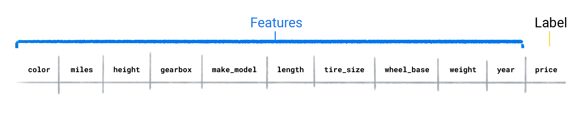
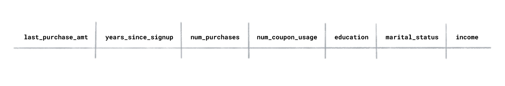
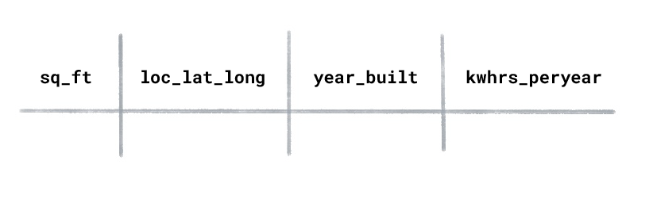

# Test Your Understanding

## Predictive power

Supervised ML models are trained using datasets with labeled examples. The model learns how to predict the label from the features.

 However, not every feature in a dataset has predictive power.

 In some instances, only a few features act as predictors of the lable. In the dataset below, use price as the label and the remaining columns as the features.

## Which three features do you think are likely the greatest predictors for a car's price?

   1. Tire_size, wheel_base, year.
   2. Miles, gearbox, make_model.
   3. Make_model, year, miles.
   4. Color, height, make_model.

Make_model, year, miles.
A car's make/model, year, and miles are likely to be among the strongest predictors for its price.

## Supervised and unsupervised learning

Based on the problem, you'll use either a supervised or unsupervised approach.

For example, if you know beforehand the value or category you want to predict, you'd use supervised learning.

However, if you wanted to learn if your dataset contains any segmentations or groupings of related examples, you'd use unsupervised learning.

Suppose you had a dataset of users for an online shopping website, and it contained the following columns:

## If you wanted to understand the types of users that visit the site, would you use supervised or unsupervised learning?4

- Supervised learning because I'm trying to predict which class a user belongs to.
- Unsupervised learning.

Unsupervised learning.
Because we want the model to cluster groups of related customers, we'd use unsupervised learning. After the model clustered the users, we'd create our own names for each cluster, for example, "discount seekers," "deal hunters," "surfers," "loyal," and "wanderers.

"Supervised learning because I'm trying to predict which class a user belongs to.
In supervised learning, the dataset must contain the label you're trying to predict. In the dataset, there is no label that refers to a category of user.
Try again.

Suppose you had an energy usage dataset for homes with the following columns:

## What type of ML would you use to predict the kilowatt hours used per year for a newly constructed house?

- Supervised learning.
- Unsupervised learning.

Supervised learning.
Supervised learning trains on labeled examples. In this dataset "kilowatt hours used per year” would be the label because this is the value you want the model to predict. The features would be "square footage,” "location,” and "year built.”
Correct answer

Unsupervised learning.
Unsupervised learning uses unlabeled examples. In this example, "kilowatt hours used per year” would be the label because this is the value you want the model to predict.

Suppose you had a flight dataset with the following columns:

## If you wanted to predict the cost of an airplane ticket, would you use regression or classification?

- Classification
- Regression

Regression
A regression model's output is a numeric value.
Correct answer.

Classification
A classification model's output is a discrete value, normally a word. In this case, the cost of an airplane ticket is a numeric value.
Try again.

## Based on the dataset, could you train a classification model to classify the cost of an airplane ticket as "high," "average," or "low"?

- No. It's not possible to create a classification model. The airplane_ticket_cost values are numeric not categorical.

- No. Classification models only predict two categories, like spam or not_spam. This model would need to predict three categories.
- Yes, but we'd first need to convert the numeric values in the airplane_ticket_cost column to categorical values.

Yes, but we'd first need to convert the numeric values in the airplane_ticket_cost column to categorical values.
It's possible to create a classification model from the dataset. You would do something like the following:
Find the average cost of a ticket from the departure airport to the destination airport.
Determine the thresholds that would constitute "high," "average," and "low".
Compare the predicted cost to the thresholds and output the category the value falls within.
Correct answer.

## Training and evaluating

After we've trained a model, we evaluate it by using a dataset with labeled examples and compare the model's predicted value to the label's actual value.

Select the two best answers for the question.

### If the model's predictions are far off, what might you do to make them better?

- Try a different training approach. For example, if you used a supervised approach, try an unsupervised approach.
- Retrain the model using a larger and more diverse dataset.
- Retrain the model, but use only the features you believe have the strongest predictive power for the label.
- You can't fix a model whose predictions are far off.

Retrain the model using a larger and more diverse dataset.
Models trained on datasets with more examples and a wider range of values can produce better predictions because the model has a better generalized solution for the relationship between the features and the label.
1 of 2 correct answers.
Retrain the model, but use only the features you believe have the strongest predictive power for the label.
Retraining the model with fewer features, but that have more predictive power, can produce a model that makes better predictions.