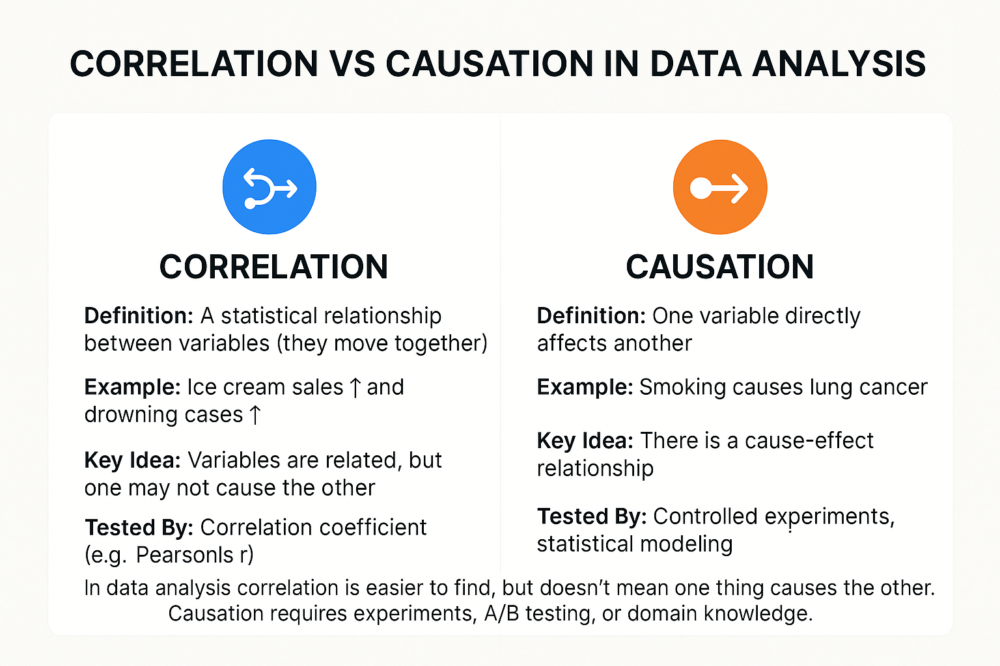

# Ai and Ml Questions

## Data Analitic

### Q1. Types of data analysis

Data analysis can be categorized into **four main types**, each serving a different purpose in the decision-making process:

---

**1. Descriptive Analysis**

**Purpose:** *What happened?*

**Description:**

* Summarizes historical data to understand changes over time.
* Focuses on patterns, trends, and simple metrics.

**Examples:**

* Sales reports, average customer age, website traffic summaries.

**Tools:** Excel, SQL, Tableau, Power BI.

---

### **2. Diagnostic Analysis**

**Purpose:** *Why did it happen?*

**Description:**

* Dives deeper into data to identify causes of trends or anomalies.
* Often involves comparing different groups or variables.

**Examples:**

* Why did revenue drop last quarter?
* What caused a spike in customer complaints?

**Tools:** Python (Pandas, Seaborn), R, advanced SQL, Jupyter Notebooks.

---

### **3. Predictive Analysis**

**Purpose:** *What is likely to happen?*

**Description:**

* Uses historical data, statistics, and machine learning to make forecasts.

**Examples:**

* Predicting customer churn, forecasting sales, stock market trends.

**Tools:** Python (Scikit-learn, XGBoost), R, TensorFlow, SAS.

---

### **4. Prescriptive Analysis**

**Purpose:** *What should we do about it?*

**Description:**

* Recommends actions based on predictions and simulations.
* Often used in decision support systems and optimization.

**Examples:**

* Dynamic pricing strategies, personalized marketing, route optimization.

**Tools:** Python (SciPy, PuLP), R, decision trees, operations research tools.

---

### Bonus: **Exploratory Data Analysis (EDA)**

**Purpose:** *What insights can we discover?*

**Description:**

* Used in the early phase of analysis to understand structure, spot patterns, and identify anomalies.

**Examples:**

* Visualizing distributions, checking correlations, detecting outliers.

**Tools:** Python (Matplotlib, Seaborn), R, Jupyter.

| Type of Analysis        | Purpose                   | Description                                              | Examples                                            | Common Tools                                   |
|-------------------------|---------------------------|----------------------------------------------------------|-----------------------------------------------------|-------------------------------------------------|
| **Descriptive**         | What happened?            | Summarizes historical data, shows patterns and trends    | Monthly revenue report, average session time       | Excel, SQL, Tableau, Power BI                  |
| **Diagnostic**          | Why did it happen?        | Investigates causes of outcomes or anomalies             | Why did sales drop in Q2?                           | Python (Pandas), R, SQL                         |
| **Predictive**          | What is likely to happen? | Uses ML and stats to forecast future outcomes            | Predicting churn, sales forecasting                 | Scikit-learn, XGBoost, R, TensorFlow            |
| **Prescriptive**        | What should we do?        | Recommends actions using optimization and simulation     | Route optimization, dynamic pricing                | SciPy, PuLP, R, Decision Trees                  |
| **Exploratory (EDA)**   | What can we discover?     | Uncovers patterns, outliers, correlations in raw data    | Correlation matrix, box plots, data distributions  | Python (Seaborn, Matplotlib), R, Jupyter       |

### Q2. where did data analysis help?


---

### ✅ **1. Churn Prediction**

**(How many customers will leave the bank)**
➡️ **Type of Analysis:** Predictive Analysis
➡️ **Use Case:**

* Helps companies forecast how many users are likely to stop using a service.
* Especially critical in banking, telecom, SaaS, and insurance.

**Example:**

> A bank uses customer transaction history, support ticket logs, and engagement data to predict which customers are likely to close their accounts, then proactively targets them with retention offers.

---

### ✅ **2. Hyper-Personalization**

➡️ **Type of Analysis:** Prescriptive + Descriptive
➡️ **Use Case:**

* Tailoring content, offers, and services to individual users based on detailed behavioral data.
* Common in e-commerce, streaming, and banking.

**Example:**

> Netflix recommends shows based on your watching history, or a bank promotes a loan product based on your financial behavior.

---

### ✅ **3. Enhanced Risk Management**

➡️ **Type of Analysis:** Diagnostic + Predictive
➡️ **Use Case:**

* Identifying, assessing, and forecasting risks using internal and external data.
* Widely used in insurance, finance, supply chain, and cybersecurity.

**Example:**

> An insurance company uses weather data, driving behavior, and historical claims to assess risk for individual policyholders.

---


Data analysis helps across **almost every industry and domain** by turning raw data into actionable insights. Here are **key areas where data analysis plays a major role**:

---

### 🔹 **1. Business & Marketing**

**How it helps:**

* Understanding customer behavior
* Targeted advertising and segmentation
* Market trend analysis

**Example:**

> Amazon uses data to recommend products based on user behavior and purchase history.

---

### 🔹 **2. Finance**

**How it helps:**

* Risk assessment and fraud detection
* Portfolio optimization
* Credit scoring

**Example:**

> Banks use predictive analysis to assess loan default risks before approval.

---

### 🔹 **3. Healthcare**

**How it helps:**

* Diagnosing diseases from medical data
* Patient monitoring and treatment optimization
* Predicting outbreaks or admissions

**Example:**

> Hospitals use EHR (Electronic Health Records) to predict readmission rates and improve care.

---

### 🔹 **4. Retail**

**How it helps:**

* Inventory management
* Sales forecasting
* Customer loyalty analysis

**Example:**

> Walmart uses real-time data to manage supply chains and prevent overstocking.

---

### 🔹 **5. Government & Public Policy**

**How it helps:**

* Crime rate analysis
* Public health monitoring
* Policy impact measurement

**Example:**

> Governments use COVID-19 data to make decisions about lockdowns and healthcare resources.

---

### 🔹 **6. Sports**

**How it helps:**

* Player performance analysis
* Game strategy optimization
* Injury prediction

**Example:**

> Football clubs use data to scout players and refine team tactics.

---

### 🔹 **7. Manufacturing & Logistics**

**How it helps:**

* Predictive maintenance
* Quality control
* Route optimization

**Example:**

> FedEx uses data to optimize delivery routes and reduce delays.

---

### 🔹 **8. Education**

**How it helps:**

* Tracking student progress
* Personalized learning
* Dropout risk prediction

**Example:**

> EdTech platforms like Coursera use analytics to suggest relevant courses to users.

---

### Q.3 Correlation vs Causation in Data Analysis


---

## 🔹 **1. Correlation – Detailed Explanation**

### ✅ **Definition**

Correlation refers to a **statistical relationship** or **association** between two or more variables. It measures how closely the variables move in relation to each other.

* It **does not imply** that one variable causes the other.
* Expressed through a **correlation coefficient** (e.g., Pearson’s *r*), which ranges from -1 to 1:

  * +1 = perfect positive correlation
  * -1 = perfect negative correlation
  * 0 = no correlation

### ✅ **Example**

> Ice cream sales increase ⬆️ as drowning incidents increase ⬆️.

**But does ice cream cause drowning?** No. A third factor — hot weather — is likely influencing both.

### ✅ **Types of Correlation**

* **Positive Correlation**: Both variables increase together (e.g., height and weight).
* **Negative Correlation**: One variable increases while the other decreases (e.g., exercise vs. body fat).
* **Zero Correlation**: No relationship (e.g., shoe size and IQ).

---

## 🔸 **2. Causation – Detailed Explanation**

### ✅ **Definition**

Causation (or **causality**) implies that **a change in one variable directly results in a change in another**. It's a **cause-effect** relationship.

* Requires **more rigorous testing** than correlation.
* Typically determined through:

  * Controlled experiments
  * Randomized control trials (RCTs)
  * Statistical modeling (e.g., regression with controls)
  * A/B testing

### ✅ **Example**

> Smoking **causes** lung cancer.
> This is **proven** through decades of medical studies, not just because smokers and cancer patients show a statistical link.

---

## 🔗 **Correlation vs. Causation: Relationship**

### ✅ **Key Differences**

| Factor              | Correlation                   | Causation                          |
| ------------------- | ----------------------------- | ---------------------------------- |
| **Connection Type** | Statistical association       | Cause-and-effect                   |
| **Evidence Needed** | Observational data            | Experimental or statistical proof  |
| **Directionality**  | No implied direction          | One variable **affects** the other |
| **Risk**            | Can lead to false conclusions | Requires stronger validation       |

---

### ⚠️ **Why This Matters in Data Analysis**

* **Beginners often mistake correlation for causation.**

  * E.g., finding a correlation between social media usage and depression does **not** mean social media causes depression — it could be the reverse, or due to a third variable.

* Making **business or policy decisions** based on correlation **without establishing causation** can lead to **wrong investments or outcomes**.

---

### ✅ **How to Move From Correlation to Causation**

* Run **experiments** (A/B testing, RCTs)
* Use **control variables** in regression
* Apply **Granger causality** in time-series data
* Leverage **domain expertise** to hypothesize real causes
* Be **cautious with observational data**

---

### 🎯 Final Summary

> **Correlation** tells you **"these things move together."**
> **Causation** tells you **"this causes that."**

They are **not the same**, but correlation can be a **first step** to discovering causation — if tested and validated carefully.

---

### Q.4 Velocity in Big Data

### ⚡ **Velocity in Big Data: Explained Simply**

**Velocity** refers to the **speed** at which data is **generated, ingested, processed, and analyzed** in a big data system.

---

### 📌 **Definition**

> **Velocity** in big data describes how **fast data flows** from sources like social media, sensors, applications, or machines into a system for processing.

---

### 🔄 **Key Aspects of Velocity**

| Feature                   | Description                                                                 |
| ------------------------- | --------------------------------------------------------------------------- |
| **Data Generation Speed** | Billions of events or records are generated per second (e.g., tweets, IoT). |
| **Ingestion Rate**        | Speed at which data is brought into the system (Kafka, Flume, etc.).        |
| **Processing Speed**      | Real-time or near-real-time analysis (using Spark, Storm, Flink, etc.).     |
| **Decision Speed**        | Ability to make instant decisions (e.g., fraud detection, stock trading).   |

---

### 🚀 **Examples of High Velocity Data**

* 💬 **Social Media Feeds** (millions of posts per minute)
* 📱 **Mobile App Clickstreams**
* 🛰️ **IoT Devices & Sensors** (temperature, GPS, motion)
* 💳 **Financial Transactions**
* 🚗 **Autonomous Vehicle Data**

---

### 🛠️ **Technologies Handling Velocity**

| Use Case             | Tools                           |
| -------------------- | ------------------------------- |
| Real-time messaging  | Apache Kafka, RabbitMQ          |
| Real-time processing | Apache Spark Streaming, Flink   |
| Stream storage       | Amazon Kinesis, Azure Event Hub |

---

### 🎯 **Why Velocity Matters**

* Enables **real-time decision-making**
* Supports **fraud detection, anomaly detection**, live analytics
* Reduces latency in **recommendation engines**, **chatbots**, **alerts**

---

Initially, there were 3 V’s (Volume, Velocity, Variety), but now many professionals use 5–7 V’s (or more).

### Q5. Core 5 V’s of Big Data

Perfect! You're referring to the **“V’s of Big Data”** — a commonly used model to explain the **core characteristics** of big data. Initially, there were **3 V’s** (Volume, Velocity, Variety), but now many professionals use **5–7 V’s** (or more).

---

### ✅ **The Core 5 V’s of Big Data Explained**

| **V**           | **Meaning**                                                                              | **Example**                                                              |
| --------------- | ---------------------------------------------------------------------------------------- | ------------------------------------------------------------------------ |
| **1. Volume**   | The **amount** of data generated and stored (often in TBs or PBs).                       | Facebook generates **over 4 PB of data** per day.                        |
| **2. Velocity** | The **speed** at which data is created, streamed, ingested, and processed.               | IoT sensors streaming real-time data every second.                       |
| **3. Variety**  | The **different types** and formats of data (structured, semi-structured, unstructured). | Text, images, audio, video, logs, JSON, etc.                             |
| **4. Veracity** | The **accuracy and trustworthiness** of data.                                            | Misinformation on social media, duplicate records, missing values.       |
| **5. Value**    | The **usefulness** of data in generating business or operational benefits.               | Using customer behavior data to improve retention or personalize offers. |

---

### 💡 **Extended V’s (Optional but useful)**

| **V**                | **Meaning**                                                         |
| -------------------- | ------------------------------------------------------------------- |
| **6. Variability**   | Inconsistency of data flow (peak vs. low traffic, seasonal trends). |
| **7. Visualization** | Ability to convert complex data into easy-to-understand visuals.    |
| **8. Vulnerability** | Data privacy, governance, and cybersecurity concerns.               |
| **9. Volatility**    | How long the data remains valid or usable.                          |

---


### Q6.  Vector Similarity Search Typically Relies On

### 🧠 **Vector Similarity Search Typically Relies On:**

> **Vector similarity search** is a technique used to find items that are **similar** based on **vector representations** (usually generated by machine learning models like word embeddings, sentence transformers, or image encoders).

---

### ✅ **Key Techniques & Concepts It Relies On:**

| Component                                            | Description                                                                                                                                                                                                                                              |
| ---------------------------------------------------- | -------------------------------------------------------------------------------------------------------------------------------------------------------------------------------------------------------------------------------------------------------- |
| **1. Vector Embeddings**                             | Objects (text, images, audio, etc.) are first converted into high-dimensional vectors using models like **Word2Vec**, **BERT**, **CLIP**, etc.                                                                                                           |
| **2. Similarity Metrics**                            | Compares vectors using distance/similarity functions:<br> 🔸 **Cosine Similarity** (most common)<br> 🔸 **Euclidean Distance**<br> 🔸 **Dot Product**                                                                                                    |
| **3. Indexing Structures**                           | To speed up search in large datasets:<br>🔸 **FAISS** (Facebook AI Similarity Search)<br>🔸 **Annoy** (Approximate Nearest Neighbors)<br>🔸 **HNSW** (Hierarchical Navigable Small World graphs)<br>🔸 **ScaNN**, **Milvus**, **Weaviate**, **Pinecone** |
| **4. Approximate Nearest Neighbor (ANN) Algorithms** | For large datasets, exact search is slow — so ANN methods give “close enough” results very fast.                                                                                                                                                         |
| **5. Dimensionality Reduction (optional)**           | Sometimes used to reduce vector size before searching (e.g., with PCA, t-SNE).                                                                                                                                                                           |

---

### 📚 **Use Cases**

* Semantic search (Google, ChatGPT plugins)
* Image or product recommendation
* Duplicate detection
* Question answering
* Face recognition

---

### ✅ Summary

> Vector similarity search **relies on vector embeddings + similarity metrics + efficient indexing** to find "closest" items quickly in a high-dimensional space.

### 🔍 **ANN (Approximate Nearest Neighbor) in Vector Databases**

---

### ✅ **What is ANN in Vector Search?**

**ANN (Approximate Nearest Neighbor)** is an algorithmic technique used to **quickly find vectors that are closest** to a given query vector — with a trade-off between **accuracy and speed**.

---

### 🔸 **Why ANN Is Needed**

* **Exact search** is computationally expensive in high dimensions.
* ANN enables **fast retrieval** from millions/billions of vectors.
* Ideal for **real-time** applications (e.g., search, recommendations, chatbots).

---

### ⚙️ **How ANN Works in Vector Databases**

1. **Vector embeddings** are stored in the database.
2. ANN algorithms build a **searchable index** (graph/tree/hashing).
3. During query, it finds **nearest vectors quickly** with good-enough accuracy.

---

### 🔧 **Popular ANN Algorithms**

| Algorithm                                     | Description                                          |
| --------------------------------------------- | ---------------------------------------------------- |
| **HNSW** (Hierarchical Navigable Small World) | Graph-based, high accuracy + fast                    |
| **IVF** (Inverted File Index)                 | Clustering-based (used in FAISS)                     |
| **PQ** (Product Quantization)                 | Compresses vectors for speed/memory                  |
| **LSH** (Locality Sensitive Hashing)          | Hash-based, useful for very fast approximate lookups |

---

### 🧠 **Used By Vector Databases Like:**

* **FAISS** (Facebook)
* **Milvus**
* **Pinecone**
* **Weaviate**
* **Qdrant**
* **ElasticSearch (with k-NN plugin)**

---

### ⚡ **Use Case Examples**

* Finding similar images/documents/products
* Searching semantically similar questions or code
* Chatbot memory retrieval (RAG)
* Face recognition, anomaly detection

---

### Q 7. where and when to use vector databases like ChromaDB, Qdrant, and DynamoDB

Great question!

Here’s a breakdown of **where and when to use vector databases** like **ChromaDB**, **Qdrant**, and **DynamoDB** (though DynamoDB is not a vector DB — I’ll explain the distinction too):

---

## 🔹 **1. Vector Databases (ChromaDB, Qdrant, etc.)**

Vector DBs are purpose-built to store and search **vector embeddings** efficiently. They’re commonly used in **AI**, **search**, and **retrieval-augmented generation (RAG)**.

---

### ✅ **ChromaDB**

> Lightweight, open-source, local-first vector database designed for **LLMs and embeddings**.

#### 🔸 Use When:

* You're building an LLM app locally (e.g., with LangChain)
* You want **simple, fast, embedded vector search**
* Need tight integration with tools like **LangChain**, **LlamaIndex**
* You don’t need scalability across multiple machines (not for high-traffic apps)

#### 🧠 Use Cases:

* Chatbot memory store
* Document semantic search (locally)
* Prototyping vector search apps

---

### ✅ **Qdrant**

> High-performance, production-ready vector search engine with **REST API**, **gRPC**, **filtering**, **metadata**.

#### 🔸 Use When:

* You need a **cloud or production-grade** vector DB
* Require **scalable**, fast search on millions of vectors
* Need **filters + metadata search** (hybrid search)

#### 🧠 Use Cases:

* Semantic search for millions of documents/images
* E-commerce search (product + metadata)
* LLMs with hybrid search (text + filters)

---

### ✅ **Pinecone / Weaviate / Milvus**

> Similar use cases as Qdrant, with more cloud-native features and integrations (Pinecone is fully managed).

---

## ❌ **2. DynamoDB (NOT a Vector DB)**

**Amazon DynamoDB** is a **NoSQL key-value/document database**, not designed for vector similarity search.

#### 🔸 Use When:

* You need ultra-low latency for key-value or document lookups
* You’re storing app state, metadata, or user sessions
* You want scalable backend data storage

#### 🧠 Use Cases:

* Web app backend
* Shopping cart/session data
* Metadata store for indexing

---

### ✅ ✅ **Can You Combine Them?**

Yes! Many apps **store vectors in Qdrant or Chroma**, but **use DynamoDB** for storing metadata like:

* user\_id → username, preferences, etc.
* document\_id → source URL, summary, etc.

---

## ✅ Summary Table

| Feature    | ChromaDB               | Qdrant                      | DynamoDB           |
| ---------- | ---------------------- | --------------------------- | ------------------ |
| Type       | Lightweight Vector DB  | Scalable Vector DB          | NoSQL (not vector) |
| Use Case   | Prototyping, Local RAG | Production AI apps          | App data storage   |
| Query Type | Embedding search       | Vector + metadata filtering | Key-value lookup   |
| Scale      | Single-machine         | Cluster-ready               | AWS-scale          |
| Best With  | LangChain, LLM apps    | AI search, filters          | User/session data  |

---

### 8. Vector Database Use Cases

Absolutely! Here's a clean breakdown of **Vector Database Use Cases**, ideal for interviews, project design, or understanding AI system architecture.

---

## 🧠 **Top Use Cases of Vector Databases**

---

### 1. 🔍 **Semantic Search**

> Find results based on **meaning**, not exact keywords.

**Example:**
Search “cheap flight to Paris” returns results like “affordable tickets to France” — even if no keywords match exactly.

✅ Tools: FAISS, Qdrant, Pinecone
✅ Industries: Search engines, documentation portals, e-commerce

---

### 2. 💬 **Retrieval-Augmented Generation (RAG) for LLMs**

> Improve language model responses by **retrieving context** from your own data.

**Example:**
Give ChatGPT your internal documents or product manuals to answer domain-specific queries.

✅ Tools: LangChain + ChromaDB, Weaviate
✅ Use: Chatbots, enterprise AI, internal knowledge search

---

### 3. 🖼️ **Image/Video Similarity Search**

> Find **visually similar** items based on image embeddings.

**Example:**
Upload a photo of a shoe and get visually similar shoes from a catalog.

✅ Tools: Milvus, Qdrant, Elasticsearch kNN
✅ Industries: Fashion, e-commerce, facial recognition

---

### 4. 📄 **Document Clustering & Deduplication**

> Cluster similar documents or **detect near-duplicates** using vector similarity.

**Example:**
Auto-group news articles covering the same topic or remove redundant records.

✅ Use: News aggregation, content moderation, archive management

---

### 5. 📢 **Recommendation Systems**

> Recommend items based on **semantic similarity** or **user preferences** encoded as vectors.

**Example:**
“You watched this movie → You may like…” based on content or behavior embeddings.

✅ Use: Netflix, Spotify, Amazon, e-learning platforms

---

### 6. 🎭 **Anomaly Detection**

> Detect **outliers** in high-dimensional space.

**Example:**
Fraud detection in transactions, unusual server logs, or spam content.

✅ Tools: Vector DB + threshold-based alerts

---

### 7. 📱 **Chat Memory Storage**

> Store and retrieve **past conversations** as embeddings for personalized chatbots.

**Example:**
LLMs recall what you asked last week and give continuity in replies.

✅ Use: Personal AI assistants, customer support

---

### 8. 🌐 **Multilingual or Cross-Modal Search**

> Search across **languages or data types** using embeddings.

**Example:**
Search a photo using text description (CLIP), or find documents across languages.

✅ Tools: OpenAI Embeddings, CLIP, LASER, multilingual BERT

---

## 🧾 Summary Table

| Use Case                    | Benefit                       | Example                           |
| --------------------------- | ----------------------------- | --------------------------------- |
| Semantic Search             | Meaningful, fuzzy search      | Legal, academic, e-commerce sites |
| LLM + RAG                   | Context-aware AI responses    | ChatGPT with custom docs          |
| Image Similarity            | Visual matching               | Fashion search, reverse image     |
| Document Deduplication      | Reduce redundancy             | News, research, logs              |
| Recommendations             | Personalization               | Netflix, Amazon                   |
| Anomaly Detection           | Fraud or error spotting       | Banking, monitoring               |
| Chat Memory                 | Long-term memory for LLMs     | Custom assistants                 |
| Cross-modal or multilingual | Search across types/languages | Search images with text, etc.     |

---

### What is Generative AI?
### 🤖 What is **Generative AI**?

**Generative AI** is a branch of artificial intelligence that can **generate new content** such as text, images, audio, video, and code — that mimics human creativity.

---

### 🧠 **Definition**

> Generative AI uses **machine learning models** (especially deep learning) to **create** new data that is similar to the data it was trained on.

---

### 🧩 **Key Generative AI Models**

| Model Type            | Purpose                         | Examples                             |
| --------------------- | ------------------------------- | ------------------------------------ |
| **LLMs**              | Generate text, chat, code       | GPT-4, Claude, Gemini, LLaMA         |
| **Diffusion Models**  | Generate images, videos         | DALL·E, Midjourney, Stable Diffusion |
| **VAEs / GANs**       | Creative data generation        | Face generation, style transfer      |
| **Audio Models**      | Music, voice synthesis          | AudioLM, Jukebox, ElevenLabs         |
| **Multimodal Models** | Handle text + image/video/audio | GPT-4o, Gemini 1.5, Claude 3         |

---

### 📦 **Popular Applications of Generative AI**

| Category     | Real-World Uses                                                         |
| ------------ | ----------------------------------------------------------------------- |
| 💬 Text      | Chatbots, content generation, summarization, translation                |
| 🖼️ Image    | AI art, product design, virtual staging, gaming                         |
| 📹 Video     | Synthetic actors, explainer videos, motion graphics                     |
| 🔊 Audio     | AI voices, music creation, podcast production                           |
| 👨‍💻 Code   | Code generation, auto-complete, debugging (e.g., GitHub Copilot)        |
| 🧠 Knowledge | RAG (Retrieval-Augmented Generation), personalized tutoring, legal bots |

---

### 🛠️ **How It Works (Simplified)**

1. **Train on large datasets** (text, images, etc.)
2. **Learn patterns & structure**
3. **Generate similar content** based on prompt/input

---

### ⚖️ **Benefits**

* Boosts creativity & productivity
* Enables personalization at scale
* Automates repetitive tasks

---

### ⚠️ **Challenges**

* Hallucinations (AI makes up facts)
* Copyright & ethics
* Deepfakes / misinformation
* Bias in generated content

---

### 📚 Example Tools & Frameworks

* **Text**: ChatGPT, Claude, LLaMA
* **Image**: Midjourney, DALL·E, Stable Diffusion
* **Audio**: ElevenLabs, Bark, Jukebox
* **Video**: Sora (OpenAI), Runway
* **Frameworks**: HuggingFace, LangChain, Diffusers, Gradio

---

### 9.  Inventors & Pioneers in AI Fields

Here’s a clean list of **pioneers** and **inventors** behind core AI fields like **Artificial Intelligence**, **Machine Learning**, **Generative AI**, and **Natural Language Processing**:

---

## 🧠 **Inventors & Pioneers in AI Fields**

| 🧪 **Field**                          | 🧔‍♂️ **Key Inventor(s) / Pioneer(s)**                                                                                                                                         | 🏆 **Contribution / Achievement**                                                                                                                                                               |
| ------------------------------------- | ------------------------------------------------------------------------------------------------------------------------------------------------------------------------------ | ----------------------------------------------------------------------------------------------------------------------------------------------------------------------------------------------- |
| **Artificial Intelligence (AI)**      | **John McCarthy** (1956)                                                                                                                                                       | Coined the term **"Artificial Intelligence"**; organized the **Dartmouth Conference**, the birth of AI as a field                                                                               |
| **Machine Learning (ML)**             | **Arthur Samuel** (1959)                                                                                                                                                       | Introduced the term **"Machine Learning"**; built a self-learning checkers program at IBM                                                                                                       |
| **Deep Learning**                     | **Geoffrey Hinton**, **Yann LeCun**, **Yoshua Bengio**                                                                                                                         | “Godfathers of Deep Learning”; developed backpropagation, CNNs, and advanced neural networks                                                                                                    |
| **Generative AI**                     | No single inventor; but key contributors: <br>• **Ian Goodfellow** (GANs) <br>• **Alec Radford** & OpenAI (GPT series) <br>• **Google Brain**, **Stability AI**, **Anthropic** | - **GANs** (2014) revolutionized generative modeling <br> - **GPT-2/3/4** laid the foundation of large-scale generative text models                                                             |
| **Natural Language Processing (NLP)** | Early: **Alan Turing**, **Joseph Weizenbaum** <br>Modern: **Christopher Manning**, **Jacob Devlin** (BERT), **Ilya Sutskever** (GPT)                                           | - Turing proposed the **Turing Test** <br> - Weizenbaum built **ELIZA**, early chatbot <br> - Devlin introduced **BERT** (transformer-based NLP) <br> - Sutskever led GPT development at OpenAI |

---

## 📌 Summary by Field

### 🔹 AI

* 🧠 **John McCarthy** – Father of AI (1956)

### 🔹 ML

* ♟ **Arthur Samuel** – Coined **Machine Learning** (1959)

### 🔹 Deep Learning

* 🧬 **Geoffrey Hinton** – Neural networks, backpropagation
* 🧠 **Yann LeCun** – CNNs, vision
* 🧠 **Yoshua Bengio** – NLP & deep nets

### 🔹 Generative AI

* 🤯 **Ian Goodfellow** – Invented **GANs**
* 📚 **OpenAI Team** – Created **GPT**
* 🧪 **Google Brain**, **Stability AI**, **Anthropic** – Innovation in **text-to-image**, **LLMs**, **multimodal**

### 🔹 NLP

* 🧠 **Alan Turing** – Turing Test (1950)
* 🧠 **Joseph Weizenbaum** – Built ELIZA (1966)
* 🧠 **Jacob Devlin** – Invented **BERT**
* 🧠 **Ilya Sutskever** – GPT models, LLMs

---

### Q 10. 🖼️ Text-to-Image Generation in Generative AI

### 🖼️ **Text-to-Image Generation in Generative AI**

---

### ✅ **Definition:**

Text-to-Image generation is the process where **AI models create realistic or artistic images** from a **textual description** (prompt).

> 🔹 Example: Input — “A cat sitting on the moon in Van Gogh’s style” → AI generates an image.

---

### ⚙️ **How It Works**

1. **Prompt**: User provides a text description.
2. **Embedding**: Text is converted into a vector using a **language model**.
3. **Image Generation**: The vector guides a **generative model** (e.g., diffusion model) to produce an image.
4. **Output**: A new image that matches the text is created.

---

### 🔍 **Popular Models for Text-to-Image**

| Model                | Creator/Organization | Highlights                         |
| -------------------- | -------------------- | ---------------------------------- |
| **DALL·E 2 / 3**     | OpenAI               | Photorealism, surreal creativity   |
| **Stable Diffusion** | Stability AI         | Open-source, customizable          |
| **Midjourney**       | Independent lab      | Artistic, high-quality visuals     |
| **Imagen**           | Google               | High fidelity, limited public use  |
| **SDXL**             | Stability AI         | Powerful upgraded Stable Diffusion |
| **Runway Gen-2**     | Runway ML            | Video & image generation           |

---

### 🧠 **Model Architecture Used**

* **Diffusion Models**: Gradually refine random noise into images guided by text.
* **Transformers**: Encode the input text (like CLIP or T5).
* **Autoencoders / U-Nets**: Help upscale and denoise images.

---

### 🎨 **Use Cases**

| Domain             | Application                                     |
| ------------------ | ----------------------------------------------- |
| 🧑‍🎨 Art & Design | Concept art, character design, creative visuals |
| 🛍️ E-Commerce     | Product mockups, virtual try-ons                |
| 📚 Education       | Visualizing textbook content, diagrams          |
| 🎮 Gaming          | Environment and asset generation                |
| 📽️ Media & Ads    | Storyboarding, AI-generated visuals             |
| 📱 Apps & UX       | Backgrounds, stickers, mobile UIs               |

---

### 📌 **Prompt Engineering (Tips)**

* Be descriptive and specific:
  `"A futuristic city at sunset in anime style with flying cars"`
* Use style cues:
  `"... in watercolor style"`, `"digital painting"`, `"8K render"`

---

### ⚠️ **Challenges**

* Sometimes generates **unrealistic or biased images**
* **Prompt sensitivity** — small changes affect output
* Ethical use (deepfakes, copyright concerns)

---

### ✅ Example Prompt + Output

**Prompt**: *"A panda astronaut riding a horse on Mars, cinematic lighting, high resolution"*

**Output**: 🖼️ (Generated with DALL·E or Stable Diffusion)

---

### 🎭 **Deepfake Technology – Explained**

---

### 🔍 **What is a Deepfake?**

A **deepfake** is a **synthetic media** (video, image, or audio) where a person’s face, voice, or entire body is **replaced or mimicked** using **AI and deep learning**, often to make it appear as if they did or said something they never actually did.

> 🧠 The term **"deepfake"** comes from **"deep learning"** + **"fake"**.

---

### 🧠 **How Deepfakes Work**

Deepfakes use **deep neural networks**, especially **Autoencoders**, **GANs (Generative Adversarial Networks)**, and **transformer-based models**.

#### 🧬 Key Components:

1. **Face Detection & Alignment**
   Detect and align faces from videos/images.

2. **Training Phase**
   Train on many images of two people (source & target) to learn their facial features.

3. **Face Swapping / Generation**
   Replace the face in a video frame-by-frame using **autoencoder or GAN**.

4. **Post-Processing**
   Blend the generated face to match lighting, expressions, and movement.

---

### 🛠️ **Technologies & Tools Behind Deepfakes**

| Technology                                     | Purpose                                        |
| ---------------------------------------------- | ---------------------------------------------- |
| **Autoencoders**                               | Compress and reconstruct face features         |
| **GANs**                                       | Generate realistic-looking faces               |
| **FaceSwap / DeepFaceLab**                     | Open-source deepfake creation tools            |
| **First Order Motion Model**                   | Animate still photos based on motion templates |
| **Wav2Lip**                                    | Synchronize lips with audio                    |
| **Voice Cloning** (e.g. ElevenLabs, Tacotron2) | Synthesize voice to match a person             |

---

### 🎯 **Applications of Deepfake Tech**

| ✅ **Positive Use Cases**                   | ❌ **Risks / Negative Uses**              |
| ------------------------------------------ | ---------------------------------------- |
| 🎬 Film industry (de-aging, dubbing)       | 🔴 Misinformation / fake news            |
| 🧠 Education & Museums (resurrect history) | 🔴 Celebrity hoaxes                      |
| 🗣️ Voice assistants / dubbing             | 🔴 Fraud & scams (voice cloning attacks) |
| 🎮 Gaming & avatars                        | 🔴 Revenge porn or identity abuse        |
| 🧑‍⚕️ Mental health therapy (AI personas)  | 🔴 Political manipulation                |

---

### 🛡️ **Detection & Defense**

As deepfakes improve, so do detection methods:

| 🔍 Detection Methods                | 🔒 Prevention Tools               |
| ----------------------------------- | --------------------------------- |
| Blink rate, skin texture analysis   | Digital watermarking              |
| Inconsistent shadows/lighting       | Blockchain-based media tracking   |
| AI-based detectors (e.g., Deepware) | Face & voice verification systems |
| Inconsistent lip-sync or head pose  | Federated content review          |

---

### 📚 Real-World Examples

* 🎥 **Luke Skywalker de-aged** in *The Mandalorian* (Disney+)
* 🗣️ **Obama deepfake** created by BuzzFeed as a warning
* 🎙️ **Voice cloning** scams where attackers impersonate relatives or CEOs

---

### ⚖️ **Ethics & Laws**

Deepfakes are under scrutiny due to:

* Privacy violations
* Consent issues
* Political disruption

> Many countries are considering or have passed laws to **regulate malicious deepfake use** (e.g., California’s anti-deepfake law).

---

### 🧾 Summary

| Aspect        | Info                             |
| ------------- | -------------------------------- |
| **Tech**      | GANs, Autoencoders, Transformers |
| **Tools**     | DeepFaceLab, FaceSwap, Wav2Lip   |
| **Uses**      | Movies, education, scams         |
| **Risks**     | Misinformation, fraud, abuse     |
| **Detection** | AI-based, watermarking           |

---

### 11. What is a GAN?

### 🎮 **GAM (General Adversarial Mechanism)** — or more commonly known as **GAN (Generative Adversarial Network)**

It seems you meant **GAN**, which is the correct term used in **generative AI**.

---

## 🧠 What is a **GAN**?

A **Generative Adversarial Network (GAN)** is a **type of deep learning model** in which **two neural networks** compete with each other to **generate realistic data** — like images, audio, video, etc.

> Invented by **Ian Goodfellow** in **2014**.

---

### 🔁 GAN = Generator + Discriminator

| Component            | Role                                                        |
| -------------------- | ----------------------------------------------------------- |
| 🎨 **Generator**     | Learns to **create fake but realistic** data (e.g., images) |
| 🔍 **Discriminator** | Learns to **distinguish real** from **fake** data           |

They are trained **adversarially**:

* The **generator** tries to **fool** the discriminator.
* The **discriminator** tries to **catch** the fakes.

Training continues until the generator becomes so good that the discriminator can no longer tell the difference.

---

### 📈 How GANs Work — Step-by-Step

1. **Input**: Generator receives random noise.
2. **Generation**: Generator produces a fake sample (e.g., an image).
3. **Evaluation**: Discriminator evaluates whether it’s real or fake.
4. **Feedback**: Both networks improve based on the loss (feedback).
5. **Iteration**: This loop continues until outputs are highly realistic.

---

### 🖼️ Use Cases of GANs

| Industry        | Use Case                                    |
| --------------- | ------------------------------------------- |
| 🎨 Art & Design | AI-generated paintings, avatars             |
| 👗 Fashion      | New clothing designs                        |
| 🎮 Gaming       | Realistic character or terrain generation   |
| 📸 Photography  | Super-resolution, inpainting (image repair) |
| 🧬 Healthcare   | Medical image synthesis (CT, MRI)           |
| 🛡️ Security    | Deepfake detection and generation           |
| 🧪 Research     | Data augmentation for model training        |

---

### 🧪 Variants of GANs

| GAN Type     | Purpose                                            |
| ------------ | -------------------------------------------------- |
| **DCGAN**    | Deep Convolutional GAN (used for images)           |
| **CycleGAN** | Image-to-image translation (e.g., horses ⇄ zebras) |
| **StyleGAN** | High-quality face generation (by NVIDIA)           |
| **Pix2Pix**  | Converts sketches to photos                        |
| **WGAN**     | Stabilizes training (uses Wasserstein loss)        |

---

### ⚠️ Challenges with GANs

* **Unstable training** (e.g., mode collapse)
* Requires **large datasets**
* May generate **biased or unethical content**
* **Hard to evaluate** quality objectively

---

### 🧾 Quick Summary

| Feature      | Info                                    |
| ------------ | --------------------------------------- |
| 🎓 Inventor  | Ian Goodfellow (2014)                   |
| 🔧 Key Parts | Generator + Discriminator               |
| 💡 Purpose   | Generate realistic synthetic data       |
| 🔬 Tech Used | Deep Learning, Neural Networks          |
| 🚀 Used In   | Image gen, video, music, faces, fashion |

---

### What is an Autoencoder in Generative AI?

It looks like you're asking about **Autoencoder** (not “auto encript”) in the context of **Generative AI** — a common confusion. Let me clarify everything:

---

## 🤖 What is an **Autoencoder** in Generative AI?

An **Autoencoder** is a type of **neural network** used to **compress and reconstruct data**, often images or text. It’s widely used in **generative models** to learn efficient representations and generate new data.

---

### 🔁 Structure of an Autoencoder

| Component           | Purpose                                                      |
| ------------------- | ------------------------------------------------------------ |
| 🔽 **Encoder**      | Compresses the input into a small latent vector (bottleneck) |
| 🧠 **Latent Space** | A compressed version of the input (representation)           |
| 🔼 **Decoder**      | Reconstructs the original input from the latent vector       |

---

### 🧪 Autoencoder Architecture

```
Input Image → [Encoder] → Latent Vector → [Decoder] → Reconstructed Image
```

---

### 📦 Use Cases in Generative AI

| Use Case                               | Explanation                                                                      |
| -------------------------------------- | -------------------------------------------------------------------------------- |
| 🖼️ **Image Generation**               | Train an autoencoder to generate images from noise or compressed representations |
| 🧽 **Denoising Autoencoders**          | Remove noise from corrupted input (e.g., blurry or noisy images)                 |
| 🧬 **Variational Autoencoders (VAEs)** | Generate entirely new data similar to the training set                           |
| 📉 **Dimensionality Reduction**        | Learn compressed representations (like PCA, but nonlinear)                       |
| 🎭 **Face & Object Reconstruction**    | Reconstruct missing or distorted parts of an image                               |

---

### 🧠 Difference Between AE & VAE

| Feature            | Autoencoder (AE)             | Variational Autoencoder (VAE)           |
| ------------------ | ---------------------------- | --------------------------------------- |
| Type               | Deterministic                | Probabilistic (adds noise)              |
| Generation Ability | Limited                      | Good for **new sample generation**      |
| Latent Space       | Fixed vector                 | Learned distribution (usually Gaussian) |
| Use in Gen AI      | Basic compression, denoising | True **generative** capability          |

---

### 💡 Autoencoders vs GANs

| Feature        | Autoencoder            | GAN                              |
| -------------- | ---------------------- | -------------------------------- |
| Main Goal      | Compress & reconstruct | Generate **realistic** samples   |
| Output Quality | Blurry                 | High-quality, sharp              |
| Training Type  | Self-supervised        | Adversarial (two models compete) |
| Stability      | More stable            | Often unstable to train          |

---

### ✅ Real-World Examples

| Application              | Description                                                      |
| ------------------------ | ---------------------------------------------------------------- |
| 🧠 **FaceNet**           | Uses encoders to represent faces as vectors for recognition      |
| 🧹 **Image Cleanup**     | Autoencoders used in Adobe tools to restore old photos           |
| 💡 **Data Compression**  | Compress medical images, satellite data, etc.                    |
| 🔬 **Anomaly Detection** | Reconstruct normal behavior — anomalies are poorly reconstructed |

---

### 📌 Summary

| 🔍 Feature       | 🔢 Autoencoder                              |
| ---------------- | ------------------------------------------- |
| Invented For     | Unsupervised feature learning               |
| Main Components  | Encoder, Decoder, Latent Space              |
| Used In          | Compression, generation, denoising          |
| Gen AI Use       | Variational Autoencoders (VAEs) are popular |
| Compared To GANs | Easier to train, lower output fidelity      |


### Structured comparison between VAE (Variational Autoencoder) and Diffusion Model
---


Here’s a clear, structured comparison between **VAE (Variational Autoencoder)** and **Diffusion Models** — both are widely used **generative models** in AI, but they work quite differently:

---

## 🧠 **VAE vs Diffusion Models – Generative AI Comparison**

| Feature                | 🧬 **VAE (Variational Autoencoder)**                           | 🌫️ **Diffusion Models**                                               |
| ---------------------- | -------------------------------------------------------------- | ---------------------------------------------------------------------- |
| **Purpose**            | Learn latent space and generate data by sampling from it       | Generate data by reversing a noise process                             |
| **Core Idea**          | Encode input into a latent distribution, then decode           | Gradually denoise random noise into data                               |
| **Architecture**       | Encoder + Decoder (Autoencoder-style)                          | U-Net + noise schedule (no encoder needed for sampling)                |
| **Training Objective** | Maximize likelihood using KL divergence + reconstruction loss  | Minimize noise prediction error (e.g., mean squared error)             |
| **Sampling Process**   | Fast (1-step decode from latent vector)                        | Slow (many steps to denoise, 50–1000 iterations)                       |
| **Output Quality**     | Blurry, lower fidelity                                         | High-quality, photorealistic                                           |
| **Stochasticity**      | Latent space sampling adds randomness                          | Each denoising step is probabilistic                                   |
| **Training Stability** | Generally stable and efficient                                 | Requires longer training and tuning                                    |
| **Use Cases**          | Anomaly detection, compressed representation, basic generation | High-fidelity image, video, audio generation (e.g. Stable Diffusion)   |
| **Famous Models**      | Beta-VAE, VQ-VAE                                               | DALL·E 2/3, Imagen, Stable Diffusion, Midjourney                       |
| **Latent Space**       | Explicit and interpretable                                     | Not directly interpretable (optional latent space in Latent Diffusion) |

---

## 🎨 Visual Metaphor

| VAE                             | Diffusion Model                       |
| ------------------------------- | ------------------------------------- |
| Compress → Sample → Reconstruct | Noise → Denoise gradually to generate |

---

## ⚖️ Summary Table

| Criteria       | ✅ VAE                                | 🚀 Diffusion Models                   |
| -------------- | ------------------------------------ | ------------------------------------- |
| Quality        | Medium (blurry)                      | Very High (sharp, detailed)           |
| Speed          | Fast generation                      | Slow (multi-step denoising)           |
| Latent Control | Good (you can edit latent space)     | Limited unless using latent diffusion |
| Open-Source    | Common (e.g., VQ-VAE in audio/image) | Very active (Stable Diffusion, etc.)  |
| Complexity     | Easier to understand and implement   | Technically more complex              |

---

## ✅ When to Use What?

| Goal                                                            | Use          |
| --------------------------------------------------------------- | ------------ |
| Compressed representation (e.g., anomaly detection)             | ✅ VAE        |
| High-quality image generation (e.g., photorealistic faces, art) | 🚀 Diffusion |
| Fast, real-time generation with some control                    | ✅ VAE        |
| Text-to-image generation or stylized artwork                    | 🚀 Diffusion |

---

### 🔧 What Does It Mean to Fine-Tune a Model?

### 🔧 What Does It Mean to **Fine-Tune a Model**?

**Fine-tuning** is the process of **taking a pre-trained model** and **training it further on a new (usually smaller) dataset** to adapt it for a **specific task or domain**.

---

### 🚀 Why Fine-Tune Instead of Train from Scratch?

| Feature                   | Train from Scratch | Fine-Tuning                            |
| ------------------------- | ------------------ | -------------------------------------- |
| 🔋 Requires Big Data      | ✅ Yes              | ❌ No (can use small dataset)           |
| 🕒 Training Time          | Long               | Shorter                                |
| 🧠 Needs Huge Compute     | Yes                | Less (especially if you freeze layers) |
| 🎯 Task-Specific Accuracy | Hard to achieve    | Easier to get high accuracy            |

---

### 🧠 How Fine-Tuning Works

Let’s say you're fine-tuning a **language model** like GPT or a **vision model** like ResNet or CLIP:

1. **Start with a Pretrained Model**

   * Trained on large data (e.g., GPT trained on Common Crawl)

2. **Replace / Add Task-Specific Head**

   * Example: Add a classification layer or decoder

3. **Freeze or Unfreeze Layers**

   * Freeze early layers (general features)
   * Fine-tune later layers (task-specific features)

4. **Train on Your Custom Dataset**

   * Few epochs, lower learning rate

5. **Evaluate & Save Model**

---

### 🛠️ Where It's Used

| Domain              | Fine-Tuning Example                                         |
| ------------------- | ----------------------------------------------------------- |
| 🖼️ Computer Vision | Image classification (e.g., fine-tune ResNet on dog breeds) |
| 📚 NLP              | Sentiment analysis, Q\&A (fine-tune BERT, GPT)              |
| 🧬 Bioinformatics   | Protein sequence prediction                                 |
| 🗣️ Speech          | Fine-tune Whisper or Wav2Vec on dialects                    |
| 🤖 Chatbots         | Fine-tune LLaMA, Mistral, GPT models for domain-specific QA |

---

### 📦 Common Frameworks

* **Hugging Face Transformers** (NLP, vision, audio)
* **PyTorch / TensorFlow**
* **Keras**
* **OpenVINO / ONNX** (for optimized deployment)

---

### 📚 Example (NLP – Hugging Face BERT)

```python
from transformers import BertForSequenceClassification, Trainer, TrainingArguments

model = BertForSequenceClassification.from_pretrained("bert-base-uncased", num_labels=2)

training_args = TrainingArguments(
    output_dir="./results",
    num_train_epochs=3,
    per_device_train_batch_size=8,
    learning_rate=2e-5
)

trainer = Trainer(
    model=model,
    args=training_args,
    train_dataset=my_train_dataset,
    eval_dataset=my_eval_dataset
)

trainer.train()
```

---

### 🎯 Tips for Effective Fine-Tuning

* 🔍 **Use a low learning rate** (e.g., `2e-5`) to avoid "forgetting" pre-trained knowledge
* 🧊 **Freeze layers** you don’t need to update
* 🧪 **Use validation** to avoid overfitting
* 📉 **Monitor loss** — sharp drops can mean overfitting

---

### ✅ Summary

| Term        | Meaning                                         |
| ----------- | ----------------------------------------------- |
| Fine-Tuning | Re-training a pre-trained model on a new task   |
| Benefits    | Saves time, needs less data, better performance |
| Used In     | NLP, vision, audio, tabular, biomedical, etc.   |
| Tools       | Hugging Face, PyTorch, TensorFlow, Keras        |

---

### "GPT" stands for **Generative Pre-trained Transformer**:

* **Generative** ✍️: Designed to generate text—complete sentences, answers, stories, code, and more.
* **Pre-trained**: Initially trained on vast amounts of data (books, websites, articles) before being fine-tuned for specific tasks.
* **Transformer**: Refers to the neural network architecture introduced by Google in 2017 ("Attention Is All You Need"), which enables models to process and understand sequences of words efficiently.

So in full, GPT is a **Generative Pre-trained Transformer**—a model that’s pre-trained to generate coherent and context-aware text using transformer architecture.


### list of **generative AI tools that are *not* text-based**, categorized by type (images, video, audio, 3D, code, etc.):

---

### 🖼️ **Image Generation**

| Tool                        | Description                                                    |
| --------------------------- | -------------------------------------------------------------- |
| **DALL·E** (OpenAI)         | Generates images from text prompts.                            |
| **Midjourney**              | AI image generator with a distinctive art style.               |
| **Stable Diffusion**        | Open-source model for customizable image generation.           |
| **Adobe Firefly**           | AI-powered image generation within Adobe products.             |
| **Runway ML (Gen-2 Image)** | Can create or modify images using AI with text or image input. |

---

### 🎥 **Video Generation**

| Tool                  | Description                                      |
| --------------------- | ------------------------------------------------ |
| **Sora** (OpenAI)     | Converts text into realistic videos.             |
| **Runway ML (Gen-2)** | Text or image to video generation.               |
| **Pika**              | AI-powered video generation and editing.         |
| **Synthesia**         | Generates talking-head avatar videos.            |
| **DeepBrain**         | AI avatars for corporate and educational videos. |

---

### 🔊 **Audio & Music Generation**

| Tool           | Description                                      |
| -------------- | ------------------------------------------------ |
| **ElevenLabs** | Realistic AI voice cloning and speech synthesis. |
| **Voicemod**   | Real-time voice changing using AI.               |
| **Boomy**      | AI-generated music in various styles.            |
| **Aiva**       | AI music composition for soundtracks.            |
| **Soundraw**   | AI-powered royalty-free music generation.        |

---

### 🧠 **3D & Design**

| Tool              | Description                                                  |
| ----------------- | ------------------------------------------------------------ |
| **Kaedim**        | Converts 2D sketches into 3D models using AI.                |
| **Luma AI**       | Turns smartphone videos into 3D scenes and objects.          |
| **Sloyd**         | Real-time AI 3D model generation.                            |
| **Promethean AI** | Assists in creating virtual 3D environments for games or VR. |

---

### 🧬 **Code/Logic/Other Non-Text Domains**

| Tool                                                                               | Description                                                   |
| ---------------------------------------------------------------------------------- | ------------------------------------------------------------- |
| **AlphaFold (DeepMind)**                                                           | Predicts protein folding structure from amino acid sequences. |
| **Runway (Motion Brush)**                                                          | Add movement to static images or videos.                      |
| **StyleGAN / GANPaint**                                                            | Create synthetic faces or manipulate image features.          |
| **Replit Ghostwriter** (partially text, but mostly code generation with UI assist) | AI coding assistant.                                          |

---

### 🔁 What is *Non-Deterministic Output*?

**Non-deterministic output** means that **running the same input multiple times can produce different results**.

---

### 💡 Examples

1. **Generative AI** (like ChatGPT, DALL·E, etc.):

   * You give the same prompt twice → you might get different responses.
   * Why? Because models like GPT use **probabilistic sampling** (e.g., top-k, top-p, temperature) instead of always choosing the highest-likelihood token.

2. **Image Generators (e.g., Stable Diffusion)**:

   * Even with the same prompt, the random noise seed might vary → leading to a different image each time.

3. **Voice Synthesizers**:

   * Same text input → slight variation in intonation, timing, or emotion if randomness is allowed.

---

### 🔧 Why Use Non-Determinism?

* **Creativity**: Promotes variety and novelty.
* **Human-like behavior**: Adds unpredictability and richness to outputs.
* **Exploration**: Useful in brainstorming, art, writing, and design tools.

---

### 📌 How to Control It (Make it Deterministic)?

Most AI tools allow settings like:

* **Temperature = 0** → Makes output deterministic (always same result).
* **Seed** in image/audio generation → Fixing the seed ensures repeatability.

---

### ✅ Summary

| Term                  | Meaning                                                     |
| --------------------- | ----------------------------------------------------------- |
| **Deterministic**     | Same input → same output, every time.                       |
| **Non-Deterministic** | Same input → different output possible (due to randomness). |


Here's a clear, **interview-friendly explanation** of **generative models on domain data**, plus technical and practical context.

---

### 🧠 What is a Generative Model on Domain Data?

A **generative model on domain data** refers to a machine learning model trained or adapted using data from a **specific industry or field**, so it can generate realistic, context-aware outputs within that domain.

---

### ✅ Simple Definition (for Interview):

> “A generative model on domain data is a model that has been fine-tuned or trained specifically on specialized datasets—like legal documents, medical reports, or financial records—so it can produce highly relevant and accurate content within that field.”

---

### 🔍 Real Examples:

| Domain         | Use Case                                              | Model Type               |
| -------------- | ----------------------------------------------------- | ------------------------ |
| **Healthcare** | Generate discharge summaries from patient notes       | Fine-tuned GPT / T5      |
| **Finance**    | Generate or summarize invoices and transactions       | GPT + RAG or fine-tuning |
| **Legal**      | Draft NDAs or contracts with domain-specific language | GPT / Claude / LLaMA     |
| **Retail**     | Auto-generate product descriptions based on specs     | GPT-4, Gemini, Claude    |
| **Science**    | Generate chemical structures or protein sequences     | VAE, GAN, AlphaFold      |

---

### 🛠️ How You Can Build One:

1. **Choose a Base Model**:

   * For text: GPT-2, GPT-3, T5, LLaMA, FLAN-T5
   * For images: Stable Diffusion, StyleGAN
   * For code: CodeLLaMA, Codex

2. **Gather Domain Data**:
   Collect high-quality, domain-specific text, images, or structured data.

3. **Fine-tune / Instruct-tune / Prompt-tune**:

   * Use supervised training on your data.
   * Or use **prompt-tuning** or **LoRA** for lighter, cheaper adaptation.
   * Or use **RAG** (Retrieval-Augmented Generation) to query a knowledge base at runtime.

4. **Deploy & Evaluate**:
   Use metrics like BLEU, ROUGE (for text), FID (for images), or expert evaluation.

---

### 🗣 Sample Interview Response:

> “In one of my projects, I worked with generative models trained on domain-specific data—in our case, invoice documents. We fine-tuned a GPT-based model to understand common invoice structures and used it to auto-generate structured summaries. This approach increased data extraction accuracy and reduced manual effort significantly. We also explored RAG for dynamic retrieval of similar past documents.”

---

Let me know your domain (e.g. healthcare, finance, law, retail), and I can provide:

* A tailored architecture suggestion
* Sample dataset ideas
* Code template (Hugging Face or PyTorch)

Would you like that?


### 🤖 What is SHAP?

**SHAP** stands for **SHapley Additive exPlanations** — it is a powerful **model explanation technique** used to understand how machine learning models make predictions.

---

### 🧠 Simple Definition:

> **SHAP explains the contribution of each feature to a model’s prediction** by using game theory — specifically the concept of Shapley values.

---

### 📚 Origin:

* Based on **Shapley values** from **cooperative game theory**.
* Each feature is treated like a “player” in a game, and SHAP calculates how much each feature contributed to the final "score" (i.e., prediction).

---

### 📈 Why is SHAP Important?

| Reason                              | Explanation                                                      |
| ----------------------------------- | ---------------------------------------------------------------- |
| ✅ **Model interpretability**        | Helps understand why a model made a certain prediction.          |
| ✅ **Debugging models**              | Identify which features are misleading or dominant.              |
| ✅ **Compliance & trust**            | Essential in regulated industries like healthcare, banking.      |
| ✅ **Global + Local explainability** | Works on individual predictions as well as overall model trends. |

---

### 🔍 Example (Say, Predicting House Price):

| Feature        | Value  | SHAP Value | Effect on Prediction |
| -------------- | ------ | ---------- | -------------------- |
| Area (sq ft)   | 1200   | +20k       | Raises price by 20k  |
| Location Score | 8.5/10 | +15k       | Raises price by 15k  |
| Age (years)    | 30     | -10k       | Reduces price by 10k |

> So, if the base value (average prediction) is \$250k → final prediction = \$250k + 20k + 15k - 10k = **\$275k**

---

### 🧪 Used With:

* Tree-based models (XGBoost, LightGBM, Random Forest)
* Neural networks
* Any black-box model (via KernelExplainer or DeepExplainer)

---

### 🛠 Python Example:

```python
import shap
import xgboost
from sklearn.datasets import load_boston

# Load data
X, y = load_boston(return_X_y=True)
model = xgboost.XGBRegressor().fit(X, y)

# Explain
explainer = shap.Explainer(model)
shap_values = explainer(X)

# Visualize
shap.plots.beeswarm(shap_values)
```

---

### 🗣 Interview Soundbite:

> “SHAP is a model-agnostic interpretability technique that assigns each feature an importance value for a particular prediction. It’s based on Shapley values from game theory and is extremely useful for both local and global model explainability.”

---

Would you like a SHAP implementation on your own model or dataset (e.g., XGBoost, Logistic Regression, etc.)?


### 🤖 What is a GAN?

**GAN** stands for **Generative Adversarial Network** — a type of machine learning model used to generate **realistic synthetic data**, such as images, audio, or text.

---

### 🧠 Simple Definition (Interview-Ready):

> “A GAN is a generative model consisting of two neural networks — a **Generator** and a **Discriminator** — that compete with each other in a game-like setting. The Generator tries to create fake data that looks real, while the Discriminator tries to tell real from fake. Through this adversarial process, the Generator learns to produce highly realistic data.”

---

### 🧬 Key Components:

| Part              | Description                                                                                                                                      |
| ----------------- | ------------------------------------------------------------------------------------------------------------------------------------------------ |
| **Generator**     | Takes random noise as input and generates fake data (e.g., an image).                                                                            |
| **Discriminator** | Tries to distinguish real data from the fake data generated.                                                                                     |
| **Loss**          | Both networks try to improve: the Generator minimizes the Discriminator's ability to detect fakes, and the Discriminator maximizes its accuracy. |

---

### 🕹️ Training Process (like a game):

1. Generator creates a fake image.
2. Discriminator checks if it's real or fake.
3. Both get feedback (loss) and improve.
4. Repeat until Generator produces images so real that Discriminator gets confused.

---

### 📷 Common Use Cases:

* **Image generation** (e.g., fake human faces – [thispersondoesnotexist.com](https://thispersondoesnotexist.com))
* **Image-to-image translation** (e.g., turning sketches into colored photos)
* **Super-resolution** (enhancing image quality)
* **Art and Style Transfer**
* **Data augmentation** (for imbalanced datasets)
* **Deepfake generation** (with ethical concerns!)

---

### 📊 Variants of GANs:

| Type                       | Use Case                                               |
| -------------------------- | ------------------------------------------------------ |
| **DCGAN**                  | Deep Convolutional GAN – better for image generation   |
| **CycleGAN**               | Translate between image styles (e.g., horses ↔ zebras) |
| **Pix2Pix**                | Image-to-image translation with paired data            |
| **StyleGAN**               | Generate highly realistic human faces                  |
| **Wasserstein GAN (WGAN)** | Improves training stability                            |

---

### 🧪 Simple Python Example (with PyTorch or TensorFlow):

Let me know if you'd like a **code demo** or **visual example** of how a GAN works!

---

### 🗣 Interview Quote:

> “GANs are powerful generative models based on game theory. They use two networks that learn by competing — leading to synthetic data that can be almost indistinguishable from real data. They’re widely used in image generation, deepfakes, and super-resolution tasks.”

---

### 🤖 What is a VAE (Variational Autoencoder)?

**VAE** stands for **Variational Autoencoder** — a type of **generative model** that learns to **compress data into a latent space** and then reconstruct it in a meaningful, probabilistic way.

---

### 🧠 Simple Definition (Interview-Ready):

> “A VAE is a type of autoencoder that learns a probabilistic latent space instead of a fixed code. It enables generation of new data by sampling from that latent distribution, making it ideal for tasks like image generation, anomaly detection, or data interpolation.”

---

### 🔄 Key Idea:

Unlike traditional autoencoders that map input → code → output deterministically, a **VAE models the latent space as a distribution** (usually Gaussian), allowing you to **sample new data** points from it.

---

### 🧬 Key Components:

| Component        | Description                                                                             |
| ---------------- | --------------------------------------------------------------------------------------- |
| **Encoder**      | Learns to map input data to a latent space (mean `μ` and standard deviation `σ`).       |
| **Latent space** | Instead of a fixed vector, VAE learns a probability distribution over the latent space. |
| **Decoder**      | Reconstructs the input data from a sample drawn from the latent distribution.           |
| **Loss**         | Combines two terms:                                                                     |

* **Reconstruction loss** (how close the output is to the input)
* **KL Divergence** (how close the latent distribution is to a normal distribution) |

---

### 📈 Loss Function:

```text
Total Loss = Reconstruction Loss + KL Divergence
```

* **Reconstruction Loss**: Measures how well the model reconstructs the input (e.g., MSE or Binary Cross-Entropy).
* **KL Divergence**: Penalizes divergence from a standard Gaussian distribution, ensuring well-behaved latent space.

---

### 📷 Use Cases:

* ✅ **Image generation** (e.g., generate digits, faces, etc.)
* ✅ **Anomaly detection** (unusual inputs don’t reconstruct well)
* ✅ **Latent space interpolation** (smooth morphing between data points)
* ✅ **Denoising**
* ✅ **Semi-supervised learning**

---

### 📊 VAE vs GAN:

| Feature        | VAE                        | GAN                              |
| -------------- | -------------------------- | -------------------------------- |
| Training       | Stable                     | Often unstable                   |
| Output Quality | Blurry but diverse         | Sharp but sometimes inconsistent |
| Latent Space   | Structured & interpretable | Less interpretable               |
| Mode Collapse  | Rare                       | Common                           |

---

### 🧪 Python Code (PyTorch - Minimal Example):

```python
import torch
import torch.nn as nn

class VAE(nn.Module):
    def __init__(self, input_dim=784, hidden_dim=400, latent_dim=20):
        super(VAE, self).__init__()
        self.fc1 = nn.Linear(input_dim, hidden_dim)
        self.fc21 = nn.Linear(hidden_dim, latent_dim)  # μ
        self.fc22 = nn.Linear(hidden_dim, latent_dim)  # log(σ²)
        self.fc3 = nn.Linear(latent_dim, hidden_dim)
        self.fc4 = nn.Linear(hidden_dim, input_dim)

    def encode(self, x):
        h = torch.relu(self.fc1(x))
        return self.fc21(h), self.fc22(h)

    def reparameterize(self, mu, logvar):
        std = torch.exp(0.5 * logvar)
        eps = torch.randn_like(std)
        return mu + eps * std

    def decode(self, z):
        h = torch.relu(self.fc3(z))
        return torch.sigmoid(self.fc4(h))

    def forward(self, x):
        mu, logvar = self.encode(x.view(-1, 784))
        z = self.reparameterize(mu, logvar)
        return self.decode(z), mu, logvar
```

---

### 🗣 Interview One-Liner:

> “VAEs are generative models that encode data into a distribution over a latent space, allowing for smooth sampling and interpolation. They’re great for tasks where a structured, continuous latent space is beneficial.”

---

### ✅ Machine Learning Types That Use Labeled Data

The machine learning type that uses **labeled data** is called **Supervised Learning**.

---

### 🧠 What is Labeled Data?

**Labeled data** means that each input example is paired with the correct output.
Examples:

* Image of a cat 🐱 → Label: `"cat"`
* House features (size, location) → Price
* Email text → Label: `"spam"` or `"not spam"`

---

### 📘 Types of Supervised Learning

| Type               | Description                    | Examples                           |
| ------------------ | ------------------------------ | ---------------------------------- |
| **Classification** | Predicts categories or classes | Spam detection, disease prediction |
| **Regression**     | Predicts continuous values     | House price, temperature forecast  |

---

### 🛠️ Common Algorithms for Supervised Learning:

| Algorithm                         | Type           |
| --------------------------------- | -------------- |
| Logistic Regression               | Classification |
| Decision Trees                    | Both           |
| Support Vector Machines (SVM)     | Both           |
| k-Nearest Neighbors               | Both           |
| Random Forest                     | Both           |
| Gradient Boosting (e.g., XGBoost) | Both           |
| Neural Networks                   | Both           |

---

### 🗣 Interview One-Liner:

> “Supervised learning is a machine learning type that relies on labeled data — where the model learns by mapping inputs to known outputs. It's used for tasks like classification and regression.”

---

Would you like:

* A diagram showing **types of ML** (supervised vs unsupervised vs reinforcement)?
* A short **comparison** with unsupervised and semi-supervised learning?


### ✅ Common Algorithms Used for **Classification** Tasks in Machine Learning

Classification involves predicting **discrete labels or categories** (e.g., "spam" vs "not spam", "disease present" vs "not present").

---

### 🧠 Top Classification Algorithms

| Algorithm                                                 | Type                            | Best For                                     |
| --------------------------------------------------------- | ------------------------------- | -------------------------------------------- |
| **Logistic Regression**                                   | Linear, binary/multiclass       | Baseline classifier, interpretability        |
| **K-Nearest Neighbors (KNN)**                             | Instance-based                  | Small datasets, pattern similarity           |
| **Support Vector Machine (SVM)**                          | Linear/Non-linear (via kernels) | High-dimensional spaces, margin maximization |
| **Decision Tree**                                         | Tree-based, interpretable       | Rule-based models, easy to visualize         |
| **Random Forest**                                         | Ensemble of trees (Bagging)     | High accuracy, avoids overfitting            |
| **Gradient Boosting (e.g., XGBoost, LightGBM, CatBoost)** | Ensemble (Boosting)             | High-performance models, tabular data        |
| **Naive Bayes**                                           | Probabilistic                   | Text classification, spam detection          |
| **Neural Networks (MLP)**                                 | Deep learning                   | Complex, non-linear patterns                 |
| **LDA (Linear Discriminant Analysis)**                    | Linear classifier               | Small datasets, feature reduction            |

---

### 📦 Examples of Use

| Task                      | Algorithm Examples                  |
| ------------------------- | ----------------------------------- |
| Email spam detection      | Naive Bayes, Logistic Regression    |
| Image recognition         | CNN (a type of Neural Network)      |
| Customer churn prediction | Random Forest, XGBoost              |
| Sentiment analysis        | Logistic Regression, LSTM, BERT     |
| Disease classification    | SVM, Random Forest, Neural Networks |

---

### 🗣 Interview-Ready Summary:

> “There are many classification algorithms, each with its strengths. For example, logistic regression is simple and interpretable, decision trees are easy to explain, and ensemble methods like Random Forest and XGBoost provide high accuracy. The best choice depends on the data size, features, and interpretability needs.”

---

Would you like:

* A decision guide to **choose the best classification algorithm**?
* **Python code examples** for each of these?


### ✅ Classification Algorithms in `scikit-learn` (`sklearn`)

`scikit-learn` is one of the most widely used Python libraries for machine learning, and it provides **many classification algorithms** out of the box.

---

### 🧠 Common Classification Algorithms in `sklearn`

| Algorithm                             | `scikit-learn` Class                                    |
| ------------------------------------- | ------------------------------------------------------- |
| **Logistic Regression**               | `sklearn.linear_model.LogisticRegression`               |
| **K-Nearest Neighbors**               | `sklearn.neighbors.KNeighborsClassifier`                |
| **Support Vector Machine**            | `sklearn.svm.SVC`                                       |
| **Decision Tree**                     | `sklearn.tree.DecisionTreeClassifier`                   |
| **Random Forest**                     | `sklearn.ensemble.RandomForestClassifier`               |
| **Gradient Boosting**                 | `sklearn.ensemble.GradientBoostingClassifier`           |
| **Naive Bayes**                       | `sklearn.naive_bayes.GaussianNB`, `MultinomialNB`, etc. |
| **Voting Classifier**                 | `sklearn.ensemble.VotingClassifier`                     |
| **Stochastic Gradient Descent (SGD)** | `sklearn.linear_model.SGDClassifier`                    |
| **Bagging/Boosting**                  | `BaggingClassifier`, `AdaBoostClassifier`               |

---

### 🧪 Example Code: Train a Classifier in `sklearn`

```python
from sklearn.datasets import load_iris
from sklearn.model_selection import train_test_split
from sklearn.ensemble import RandomForestClassifier
from sklearn.metrics import classification_report

# Load data
X, y = load_iris(return_X_y=True)
X_train, X_test, y_train, y_test = train_test_split(X, y, test_size=0.2)

# Initialize classifier
model = RandomForestClassifier(n_estimators=100)

# Train model
model.fit(X_train, y_train)

# Predict
y_pred = model.predict(X_test)

# Evaluate
print(classification_report(y_test, y_pred))
```

---

### 🗣 Interview Tip:

> “`scikit-learn` provides a unified API for a wide range of classification algorithms. I can quickly prototype models, tune hyperparameters using `GridSearchCV`, and evaluate them using built-in metrics like accuracy, precision, recall, and F1-score.”

---

Would you like:

* A notebook with multiple classifiers compared on the same dataset?
* A guide to hyperparameter tuning with `GridSearchCV` or `RandomizedSearchCV`?
* A real-world dataset example (like spam, churn, or loan prediction)?


### ✅ Metrics Used for **Regression Models** — and Why They Matter

Regression models predict **continuous numerical values**, so their evaluation focuses on how **close predictions are to actual values**. Unlike classification, there are no labels or probabilities — just numbers.

---

### 🧠 Common Regression Evaluation Metrics

| Metric                                      | Formula / Concept                                           | Use Case / Why It’s Used                                           |           |                                                                 |
| ------------------------------------------- | ----------------------------------------------------------- | ------------------------------------------------------------------ | --------- | --------------------------------------------------------------- |
| **Mean Absolute Error (MAE)**               | Average of absolute errors: \`MAE = mean(                   | y\_true - y\_pred                                                  | )\`       | Simple and interpretable. Less sensitive to outliers.           |
| **Mean Squared Error (MSE)**                | Average of squared errors: `MSE = mean((y_true - y_pred)²)` | Penalizes larger errors more (sensitive to outliers).              |           |                                                                 |
| **Root Mean Squared Error (RMSE)**          | `RMSE = sqrt(MSE)`                                          | Same units as target variable. Highlights large errors.            |           |                                                                 |
| **R² Score (Coefficient of Determination)** | `1 - (SS_res / SS_total)`                                   | Measures % of variance explained by the model. Range: `(-∞, 1]`.   |           |                                                                 |
| **Adjusted R²**                             | Adjusted for number of predictors in the model              | Prevents overestimation with many features. Better for comparison. |           |                                                                 |
| **Mean Absolute Percentage Error (MAPE)**   | \`MAPE = mean(                                              | (y\_true - y\_pred)/y\_true                                        | ) × 100\` | Expresses error as a percentage. Can be biased if `y_true ≈ 0`. |
| **Median Absolute Error**                   | Median of absolute errors                                   | Robust to outliers.                                                |           |                                                                 |

---

### 🗣 Interview-Friendly Summary:

> “In regression, we typically use MAE, MSE, and RMSE to measure the average prediction error. RMSE is preferred when we want to penalize large errors more, while MAE is more robust to outliers. R² tells us how much of the variance in the target variable is explained by the model — a higher R² indicates better fit.”

---

### 📌 Quick Guidelines:

| Goal                                | Best Metric      |
| ----------------------------------- | ---------------- |
| Outlier sensitivity needed          | RMSE or MSE      |
| Outlier robustness                  | MAE or Median AE |
| Model interpretability              | MAE, RMSE        |
| Feature comparison/model complexity | Adjusted R²      |
| Percentage-based error needed       | MAPE             |

---

Would you like:

* A Python example comparing these metrics?
* Guidance on **which metric to choose for your project**?


### 🤖 What is **Reinforcement Learning (RL)?**

**Reinforcement Learning** is a type of machine learning where an **agent learns by interacting with an environment**, making decisions to **maximize rewards** over time.

---

### 🧠 Simple Definition (Interview-Ready):

> “Reinforcement learning is a feedback-driven learning method where an agent learns to take actions in an environment to maximize cumulative rewards. Unlike supervised learning, RL does not rely on labeled data — instead, it learns from trial and error.”

---

### 🏗️ Core Components of RL

| Element                | Description                                                               |
| ---------------------- | ------------------------------------------------------------------------- |
| **Agent**              | The learner or decision-maker (e.g., a robot, algorithm, player)          |
| **Environment**        | The system with which the agent interacts (e.g., a game, real-world task) |
| **State (S)**          | Current situation of the agent in the environment                         |
| **Action (A)**         | Set of possible moves the agent can make                                  |
| **Reward (R)**         | Feedback signal received after an action is taken                         |
| **Policy (π)**         | Strategy the agent follows to choose actions                              |
| **Value Function (V)** | Estimates future rewards from a given state                               |
| **Q-Function (Q)**     | Estimates future rewards from a given state-action pair                   |

---

### 🔁 The RL Learning Cycle:

1. Agent observes current **state (Sₜ)**
2. Chooses an **action (Aₜ)** using policy π
3. Environment responds with:

   * **Next state (Sₜ₊₁)**
   * **Reward (Rₜ)**
4. Agent updates its policy based on reward

---

### 🧠 Types of Reinforcement Learning Algorithms

| Category                   | Model Types                                                     |
| -------------------------- | --------------------------------------------------------------- |
| **Model-Free RL**          | Agent learns directly from experience (no model of environment) |
| - **Value-Based**          | Q-Learning, Deep Q-Network (DQN)                                |
| - **Policy-Based**         | REINFORCE, Policy Gradient, PPO                                 |
| - **Actor-Critic Methods** | A3C, DDPG, TD3, SAC                                             |
| **Model-Based RL**         | Agent builds a model of environment and uses it to plan         |
| - **Planning Algorithms**  | Dyna-Q, Monte Carlo Tree Search (MCTS)                          |

---

### 📈 Popular RL Models & Frameworks

| Model / Algorithm                      | Description                               | Use Case                         |
| -------------------------------------- | ----------------------------------------- | -------------------------------- |
| **Q-Learning**                         | Learns value of action for each state     | Tabular problems, small games    |
| **Deep Q-Network (DQN)**               | Combines Q-Learning with deep neural nets | Atari games, robotics            |
| **Policy Gradient**                    | Optimizes policy directly                 | Continuous action spaces         |
| **PPO (Proximal Policy Optimization)** | Stable & widely used modern algorithm     | Robotics, games, industry RL     |
| **A3C / A2C**                          | Parallel actor-critic learning            | Asynchronous training            |
| **DDPG / TD3 / SAC**                   | For continuous control problems           | Self-driving, industrial control |

---

### 🎮 Real-World Applications

* ✅ **Gaming** – AlphaGo, AlphaStar, OpenAI Five
* ✅ **Robotics** – Path planning, movement control
* ✅ **Finance** – Trading bots, portfolio optimization
* ✅ **Healthcare** – Treatment strategies
* ✅ **Autonomous Vehicles** – Decision making & control
* ✅ **Recommendation Systems** – Sequential decision learning

---

### 🗣 Interview One-Liner:

> “Reinforcement Learning is a trial-and-error-based learning framework where an agent learns optimal actions by maximizing cumulative rewards. It’s ideal for decision-making tasks and is used in robotics, game AI, and autonomous systems.”

---

Would you like:

* A Python code example (e.g., Q-learning or DQN)?
* A visual diagram of the RL loop?
* A quick comparison of RL vs supervised vs unsupervised learning?

### 🧠 Clustering Algorithms in Machine Learning

**Clustering** is an **unsupervised learning technique** used to group data points into **clusters** such that points in the same cluster are more similar to each other than to those in other clusters.

---

### ✅ Common Clustering Algorithms:

| Algorithm                         | Type                   | Best For                                          |
| --------------------------------- | ---------------------- | ------------------------------------------------- |
| **K-Means**                       | Centroid-based         | Large datasets, spherical clusters                |
| **Hierarchical Clustering**       | Connectivity-based     | Tree-like cluster structure (dendrograms)         |
| **DBSCAN**                        | Density-based          | Arbitrary-shaped clusters, noise handling         |
| **Mean Shift**                    | Centroid-based         | Non-parametric, adaptive bandwidth                |
| **OPTICS**                        | Density-based          | Like DBSCAN, but more robust to varying densities |
| **Gaussian Mixture Models (GMM)** | Model-based            | Soft clustering (probability of membership)       |
| **Spectral Clustering**           | Graph-based            | Non-convex clusters, graph similarity             |
| **Agglomerative Clustering**      | Bottom-up Hierarchical | Merges smallest clusters first                    |
| **BIRCH**                         | Tree-based, scalable   | Large datasets, streaming data                    |
| **Affinity Propagation**          | Message passing        | Doesn’t require number of clusters upfront        |

---

### 📌 Quick Comparison:

| Algorithm    | Needs K upfront? | Handles noise? | Works with non-spherical data? | Scalable?               |
| ------------ | ---------------- | -------------- | ------------------------------ | ----------------------- |
| K-Means      | ✅ Yes            | ❌ No           | ❌ No                           | ✅ High                  |
| DBSCAN       | ❌ No             | ✅ Yes          | ✅ Yes                          | ⚠️ Medium               |
| GMM          | ✅ Yes            | ❌ No           | ✅ Yes                          | ✅ High                  |
| Hierarchical | ❌ No             | ❌ No           | ✅ Yes                          | ⚠️ Low (for large data) |

---

### 🗣 Interview Line:

> “Clustering algorithms like K-Means, DBSCAN, and GMM help uncover hidden groupings in data. K-Means is great for speed and simplicity, DBSCAN is ideal for noisy and irregular data, and GMM supports soft clustering where each point has a probability of belonging to a cluster.”

---

Would you like:

* A **visual comparison** of clustering algorithms?
* A **Python demo** comparing K-Means, DBSCAN, and GMM?
* Guidance on **which clustering algorithm to choose** for your dataset?

### 🤖 What is **Deep Learning**?

**Deep Learning** is a subset of **machine learning** that uses **artificial neural networks** with many layers (i.e., "deep") to automatically learn patterns from data — especially large, complex, and unstructured data like **images, audio, video, and text**.

---

### 🧠 Simple Definition (Interview-Ready):

> “Deep learning uses multi-layered neural networks to learn complex patterns and features directly from raw data. It powers many modern AI applications, from speech recognition to image generation.”

---

### 📦 Key Concepts in Deep Learning

| Concept                 | Description                                                     |
| ----------------------- | --------------------------------------------------------------- |
| **Neural Network**      | A system of interconnected layers (neurons) that learn features |
| **Activation Function** | Adds non-linearity (e.g., ReLU, sigmoid, tanh)                  |
| **Loss Function**       | Measures prediction error during training                       |
| **Backpropagation**     | Algorithm to update weights using gradients                     |
| **Optimizer**           | Algorithm to minimize loss (e.g., SGD, Adam)                    |
| **Epochs & Batches**    | Data is trained in batches over multiple epochs                 |

---

### 🧠 Common Deep Learning Architectures

| Type                                     | Use Case                               |
| ---------------------------------------- | -------------------------------------- |
| **CNN (ConvNet)**                        | Image classification, object detection |
| **RNN / LSTM / GRU**                     | Time series, NLP tasks, sequences      |
| **Transformer**                          | NLP (e.g., BERT, GPT), vision models   |
| **GAN (Generative Adversarial Network)** | Image generation                       |
| **Autoencoders**                         | Data compression, anomaly detection    |

---

### 🛠 Popular Deep Learning Frameworks

| Framework      | Language                 | Strengths                                                                          |
| -------------- | ------------------------ | ---------------------------------------------------------------------------------- |
| **TensorFlow** | Python, C++              | Production-ready, scalable, supports mobile/embedded (via TensorFlow Lite)         |
| **Keras**      | Python                   | High-level API on top of TensorFlow; simple and beginner-friendly                  |
| **PyTorch**    | Python, C++              | Flexible, Pythonic, dynamic computation graph; favored in research                 |
| **JAX**        | Python                   | High-performance, optimized for scientific computing and automatic differentiation |
| **MXNet**      | Python, Scala            | Scalable and efficient for multi-GPU training                                      |
| **Caffe**      | C++, Python              | Fast for vision tasks; less flexible                                               |
| **Theano**     | Python                   | Early framework, now largely deprecated                                            |
| **ONNX**       | Format (not a framework) | Used to convert models between frameworks (e.g., PyTorch → TensorFlow)             |

---

### 🗣 Interview-Friendly Summary:

> “Deep learning is a class of machine learning that uses multi-layered neural networks to learn directly from data. Frameworks like PyTorch and TensorFlow provide tools to design, train, and deploy models efficiently. PyTorch is preferred for research due to its dynamic graph structure, while TensorFlow is often used in production for its scalability.”

---

### 🚀 Real-World Applications of Deep Learning

* **Vision**: Face recognition, object detection, medical imaging (e.g., CNNs)
* **Speech**: Speech-to-text, voice assistants (e.g., RNNs, Transformers)
* **NLP**: Machine translation, chatbots, summarization (e.g., BERT, GPT)
* **Generative AI**: Image generation, deepfakes (e.g., GANs)
* **Autonomous systems**: Drones, self-driving cars

---

Would you like:

* A **diagram comparing TensorFlow vs PyTorch**?
* A **starter code for CNN or LSTM in PyTorch or TensorFlow**?
* A guide on **which framework to choose for your project or research**?


### ✅ Machine Learning Algorithm for Grouping Similar Data

If you're looking to **group similar data without labels**, the correct type of machine learning is **Unsupervised Learning**, specifically:

---

### 🤖 **Clustering Algorithms**

These are used to automatically **group data points that are similar to each other** into clusters.

---

### 📌 Popular Clustering Algorithms (Grouping Techniques):

| Algorithm                         | Type           | Best For                                    |
| --------------------------------- | -------------- | ------------------------------------------- |
| **K-Means**                       | Centroid-based | Simple and fast on spherical clusters       |
| **DBSCAN**                        | Density-based  | Arbitrary-shaped clusters, noise handling   |
| **Hierarchical Clustering**       | Tree-based     | Visual hierarchy (dendrograms)              |
| **GMM (Gaussian Mixture Models)** | Probabilistic  | Soft clustering (probability of membership) |
| **Spectral Clustering**           | Graph-based    | Complex non-convex shapes                   |
| **Mean Shift**                    | Centroid-based | Adaptive bandwidth estimation               |

---

### 🧠 Real-World Examples of Grouping Similar Data:

| Task                                                    | Algorithm(s) Used                |
| ------------------------------------------------------- | -------------------------------- |
| Customer segmentation in marketing                      | K-Means, DBSCAN                  |
| Social network community detection                      | Spectral Clustering              |
| Image compression or color quantization                 | K-Means                          |
| Document topic grouping                                 | GMM, K-Means (on TF-IDF vectors) |
| Anomaly detection (grouping normal vs outlier behavior) | DBSCAN                           |

---

### 🗣 Interview Soundbite:

> “To group similar data points in an unsupervised manner, clustering algorithms like K-Means or DBSCAN are ideal. These models learn patterns based on feature similarity and are widely used in customer segmentation, anomaly detection, and pattern discovery.”

---

Would you like:

* A **visual comparison of clustering algorithms**?
* A **Python code demo** for grouping data using K-Means or DBSCAN?
* Help choosing the right algorithm based on your dataset's characteristics?

If you're looking for **algorithms that rank features based on their importance**, you're referring to **feature selection or feature importance** techniques.

These are essential in both **model interpretability** and **dimensionality reduction**.

---

### ✅ Algorithms That Rank Features Based on Importance

| Algorithm / Method                       | Description                                                                |
| ---------------------------------------- | -------------------------------------------------------------------------- |
| **Random Forest / Tree-Based Models**    | Provides built-in feature importance (via Gini importance or permutation)  |
| **XGBoost / LightGBM / CatBoost**        | Gradient boosting models with accurate and fast feature importance ranking |
| **LASSO Regression (L1 Regularization)** | Shrinks less important feature coefficients to zero                        |
| **Recursive Feature Elimination (RFE)**  | Recursively removes least important features using a base estimator        |
| **SHAP (SHapley Additive exPlanations)** | Model-agnostic, explains feature contributions per prediction              |
| **Permutation Importance**               | Measures change in model performance when a feature's values are shuffled  |
| **Chi-Square Test**                      | For categorical features and target (statistical significance ranking)     |
| **ANOVA (F-test)**                       | Measures variance between groups for continuous features                   |
| **Mutual Information**                   | Measures dependency between features and target                            |
| **Boruta**                               | All-relevant feature selection method based on Random Forest               |

---

### 🔍 Example: Feature Importance with Random Forest

```python
from sklearn.ensemble import RandomForestClassifier
from sklearn.datasets import load_iris
import pandas as pd

# Load data
data = load_iris()
X, y = data.data, data.target
feature_names = data.feature_names

# Fit model
model = RandomForestClassifier()
model.fit(X, y)

# Get feature importance
importances = model.feature_importances_
importance_df = pd.DataFrame({
    'Feature': feature_names,
    'Importance': importances
}).sort_values(by='Importance', ascending=False)

print(importance_df)
```

---

### 🗣 Interview One-Liner:

> “To rank features by importance, tree-based models like Random Forest or XGBoost are highly effective and interpretable. For model-agnostic explanations, SHAP or permutation importance offers deeper insights.”

---

Would you like:

* A notebook comparing these methods side by side?
* A feature selection pipeline example for your dataset?
* SHAP or LASSO-based visualization for top features?

An **algorithm that learns from the outcome** is typically associated with **Reinforcement Learning (RL)** — where an agent learns by interacting with an environment and adjusting its behavior based on **feedback (rewards or penalties)** it receives after each action.

---

### 🧠 Simple Definition:

> **Reinforcement Learning** is a type of machine learning where an agent learns by trial and error — taking actions and learning from the **outcome** (reward or punishment) to improve future decisions.

---

### ✅ Key Characteristics:

| Feature                    | Description                                                                  |
| -------------------------- | ---------------------------------------------------------------------------- |
| **Learns from outcome**    | Feedback comes in the form of **rewards** (positive/negative) after actions. |
| **No labeled data**        | It doesn't require labeled input-output pairs like supervised learning.      |
| **Goal-directed learning** | The objective is to **maximize cumulative reward over time**.                |

---

### 🏗️ Components of Reinforcement Learning:

| Component       | Description                                   |
| --------------- | --------------------------------------------- |
| **Agent**       | The learner or decision-maker.                |
| **Environment** | Where the agent operates.                     |
| **Action (A)**  | What the agent can do.                        |
| **State (S)**   | The current situation.                        |
| **Reward (R)**  | Feedback after performing an action.          |
| **Policy (π)**  | Strategy used by the agent to decide actions. |

---

### 📌 Common RL Algorithms:

| Algorithm                | Description                                                  |
| ------------------------ | ------------------------------------------------------------ |
| **Q-Learning**           | Learns value of actions in each state.                       |
| **Deep Q-Network (DQN)** | Combines Q-learning with deep learning.                      |
| **Policy Gradient**      | Directly learns the policy to take the best actions.         |
| **PPO / A3C / DDPG**     | Advanced algorithms for continuous or complex action spaces. |

---

### 🗣 Interview-Friendly Summary:

> “An algorithm that learns from outcomes is typically part of reinforcement learning. These models improve by receiving rewards or penalties from the environment, enabling them to optimize long-term performance through trial and error.”

---

Would you like:

* A **Python example** of Q-learning or DQN?
* A **real-world use case** (e.g., self-driving, game AI, robotics)?
* A **visual explanation** of how RL agents learn from outcomes?

Yes, ✅ **KNN (K-Nearest Neighbors)** is a **classification algorithm** — though it can also be used for regression.

---

### 🧠 What is KNN?

> **KNN** is a **supervised learning algorithm** that classifies a data point based on how its neighbors are classified.

It’s **instance-based** (also called **lazy learning**), meaning it doesn’t build a model during training. Instead, it:

1. Stores the training data,
2. Uses it to classify new points during prediction.

---

### 🧪 How KNN Works (Classification):

1. For a new input, calculate the distance (usually Euclidean) to all training data points.
2. Find the **K nearest neighbors**.
3. Assign the **most common class** among those neighbors.

---

### 📦 Example:

If K=3 and your input point’s 3 nearest neighbors are:

* Class A
* Class B
* Class A

Then KNN predicts: **Class A** (majority vote).

---

### 🧮 KNN Can Be Used For:

| Task             | How it works                       |
| ---------------- | ---------------------------------- |
| ✅ Classification | Majority vote of nearest neighbors |
| ✅ Regression     | Average (mean) of neighbor values  |

---

### 📌 Notes:

* Performance depends on choosing a good **K** value.
* It’s sensitive to the **scale of features** (use normalization).
* Works best with **small to medium datasets**.

---

### 🗣 Interview One-Liner:

> “KNN is a simple yet powerful classification algorithm that assigns labels based on the majority vote of the nearest neighbors. It's easy to implement but can be slow for large datasets due to no model training phase.”

---

Would you like:

* A quick **Python example of KNN using scikit-learn**?
* Help on choosing the best **value of K** or **distance metric**?


### 🧠 What is **Instance-Based Learning**?

**Instance-Based Learning** (also known as **lazy learning**) is a type of machine learning where the model **stores the training data** and **delays generalization** until a query (test instance) is made.

---

### ✅ Simple Definition (Interview-Ready):

> “Instance-based learning is a learning approach where the model memorizes the training data and makes predictions by comparing new inputs to stored instances using a similarity or distance measure. It doesn’t build a model upfront — instead, it learns at the time of prediction.”

---

### 🔍 Key Characteristics:

| Feature                 | Description                                                           |
| ----------------------- | --------------------------------------------------------------------- |
| **Lazy Learning**       | No explicit training phase; generalization happens at inference time. |
| **Similarity-Based**    | Relies on distance/similarity metrics (e.g., Euclidean, cosine).      |
| **Memory-Based**        | Stores all training examples; requires significant memory.            |
| **Local Approximation** | Makes decisions based on local neighborhoods of the input.            |

---

### 🧪 Examples of Instance-Based Algorithms:

| Algorithm                             | Notes                                                               |
| ------------------------------------- | ------------------------------------------------------------------- |
| **K-Nearest Neighbors (KNN)**         | Most common; classifies based on nearby instances.                  |
| **Locally Weighted Regression (LWR)** | Predicts using nearby examples with weighted influence.             |
| **Case-Based Reasoning (CBR)**        | Common in AI; solves new problems using solutions to past problems. |
| **Radial Basis Function Networks**    | Uses distances from training examples to activate neurons.          |

---

### 📌 Pros & Cons

| ✅ Advantages              | ⚠️ Disadvantages                           |
| ------------------------- | ------------------------------------------ |
| Simple to implement       | Slow at prediction time (high latency)     |
| No training time required | Sensitive to noisy and irrelevant features |
| Adapts well to new data   | Poor scalability with large datasets       |

---

### 🗣 Interview Quote:

> “Instance-based learning delays model generalization until prediction, using stored examples to reason about new data. KNN is the classic example, comparing new inputs to their nearest neighbors using a distance metric.”

---

Would you like:

* A diagram showing **lazy vs eager learning**?
* A **code example of KNN or Locally Weighted Regression**?
* A comparison of **KNN vs decision tree** (lazy vs eager)?

Yes, **throttling can be controlled** — and it's often an important part of managing system performance, rate limits, and API usage.

---

### ✅ What is Throttling?

**Throttling** is the practice of **controlling the rate at which requests are processed**. It helps prevent overuse of resources, protects systems from overload, and ensures fair usage.

---

### 🧰 How Throttling Can Be Controlled (By Type):

#### 1. **In APIs**

| Method                          | How It Works                                                        |
| ------------------------------- | ------------------------------------------------------------------- |
| **Rate Limiting**               | Limit number of requests per user/IP/token per time (e.g., 100/min) |
| **Token Bucket / Leaky Bucket** | Algorithms to allow bursts with controlled drain rates              |
| **Quota Systems**               | Users allowed fixed usage over time                                 |
| **HTTP 429 Error**              | Returned when limit is exceeded                                     |

✅ **Control with**:

* FastAPI middleware
* NGINX config
* API Gateway (AWS, Azure, etc.)

---

#### 2. **In Background Tasks / Jobs**

| Control Mechanism          | Description                                                      |
| -------------------------- | ---------------------------------------------------------------- |
| **Task Queue Rate Limits** | Celery, Dramatiq, etc., can set per-worker or global task limits |
| **Debouncing / Batching**  | Delay or combine frequent events                                 |
| **Sleep / Backoff**        | Delay between retries or task intervals                          |

---

#### 3. **In Network Traffic**

| Control Method               | Description                           |
| ---------------------------- | ------------------------------------- |
| **QoS (Quality of Service)** | Prioritize traffic types              |
| **Traffic Shaping**          | Limit bandwidth usage per device/user |
| **Firewalls / Proxies**      | Can apply throttling rules at edges   |

---

### 🧠 Interview Tip

> “Throttling is crucial for resource protection, fairness, and system reliability. It can be enforced at various levels — APIs, services, queues, and even hardware.”

---

Would you like:

* A Python example using FastAPI or Flask with throttling?
* Help implementing rate limits in Celery or Redis queues?
* A system design use case that includes throttling logic?

### 🤖 What is **K-Means Clustering**?

**K-Means** is an **unsupervised learning algorithm** used to **group data into `K` clusters** based on similarity. It partitions data such that items in the same cluster are more similar to each other than to those in other clusters.

---

### 🧠 Simple Definition (Interview-Ready):

> “K-Means is a centroid-based clustering algorithm that divides data into `K` groups by minimizing the distance between points and their cluster’s center.”

---

### 🔁 How K-Means Works (Step-by-Step):

1. **Choose `K` clusters**
2. **Randomly initialize** `K` centroids
3. Assign each point to the **nearest centroid**
4. **Update centroids** by averaging all assigned points
5. **Repeat** steps 3–4 until convergence (no more changes)

---

### 📊 Example:

If `K=3`, the algorithm will:

* Place 3 centroids in space
* Assign points to the closest centroid
* Adjust centroids repeatedly until grouping stabilizes

---

### 📌 Key Concepts:

| Term         | Meaning                                                                    |
| ------------ | -------------------------------------------------------------------------- |
| **Centroid** | The center of a cluster                                                    |
| **Inertia**  | Sum of squared distances to centroids (used to measure clustering quality) |
| **K**        | Number of desired clusters (you must specify this manually)                |

---

### 🛠 Python Code Example (with `sklearn`):

```python
from sklearn.cluster import KMeans
import matplotlib.pyplot as plt
from sklearn.datasets import make_blobs

# Generate sample data
X, _ = make_blobs(n_samples=300, centers=4, cluster_std=0.60, random_state=0)

# Apply KMeans
kmeans = KMeans(n_clusters=4)
kmeans.fit(X)
y_kmeans = kmeans.predict(X)

# Plot the clusters
plt.scatter(X[:, 0], X[:, 1], c=y_kmeans, s=50, cmap='viridis')
plt.scatter(kmeans.cluster_centers_[:, 0], kmeans.cluster_centers_[:, 1], c='red', s=200, alpha=0.75, marker='X')
plt.title("K-Means Clustering")
plt.show()
```

---

### 🧪 Pros & Cons:

| ✅ Pros                             | ⚠️ Cons                                 |
| ---------------------------------- | --------------------------------------- |
| Simple & fast                      | Requires specifying `K`                 |
| Works well with spherical clusters | Poor for non-convex shapes or outliers  |
| Scalable to large datasets         | Sensitive to initial centroid placement |

---

### 🧠 Tips:

* Use the **Elbow Method** to find the best `K` (plot `inertia` vs. `K`)
* Normalize your data for better performance
* K-Means assumes clusters are **spherical and equal-sized**

---

### 🗣 Interview Line:

> “K-Means is an unsupervised clustering method that partitions data into `K` clusters by minimizing the intra-cluster distance. It’s efficient and widely used for tasks like customer segmentation, market analysis, and image compression.”

---

Would you like:

* An example with **real-world data** like customer segmentation?
* A demo of the **Elbow Method** to choose the best `K`?
* A **visual comparison of K-Means vs DBSCAN or GMM**?
